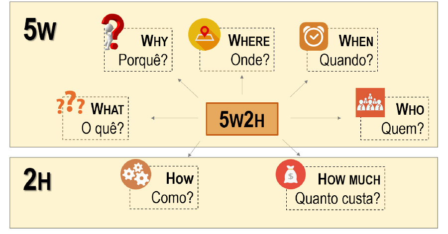

# 
 Documento de visão 5W2H

## Histórico de Versão 
|    Data    | Versão | Descrição            | Autor(es)       |
| :- | :- | :- | :- |
| 26.04.2022 |  0.1   | Criação do documento | [Sávio Cunha](https://github.com/savioc2) |

&emsp;&emsp;
<code>5W2H</code> é uma metodologia de gestão que tem como objetivo fornecer uma estrutura clara e objetiva para a definição e execução de projetos e processos. Ela consiste em responder as sete perguntas-chave, divididas em cinco Ws (What, Why, Who, Where, When) e dois Hs (How e How much), que significam espectivamente: O que?, Por quê?, Quem?, Onde?, Quando?, Como? E Quanto custa?. Respondendo a essas perguntas se estará planejando as ações de melhoria ou padronizando processos de forma organizada, garantindo que a execução das atividades aconteça da forma planejada. 

&emsp;&emsp;
O objetivo deste documento é apresentar um entendimento completo do projeto ou processo, alinhando expectativas e metas, evitando problemas de comunicação e, consequentemente, minimizando os riscos de falhas ou erros durante a execução. 

 
            <a>
               Figura 1: Exemplo do modelo 5W2H
            </a>
        </b>   
         
        <small>Fonte: https://blog.academiaperspectiva.com/o-modelo-5w2h/</small>
    

# Modelo 5W2H 
## v1.0

# Referências

- [1] - PROJECT BUILDER. 5W2H: a metodologia de planejamento que vai ajudar na sua gestão. 2022. Disponível em: https://projectbuilder.com.br/blog/5w2h-a-metodologia-de-planejamento-que-vai-ajudar-na-sua-gestao/. Acesso em: 26 abr. 2023.
- [2] - ROCK CONTENT. O que é 5W2H e como aplicá-lo na sua empresa. 2021. Disponível em: https://rockcontent.com/br/blog/5w2h/. Acesso em: 27 abr. 2023.
- [3] - GESTÃO DE PROJETOS - NA PRÁTICA. Metodologia 5W2H. 2019. Disponível em: https://www.youtube.com/watch?v=Hf8oC_tjJSo. Acesso em: 26 abr. 2023. 

