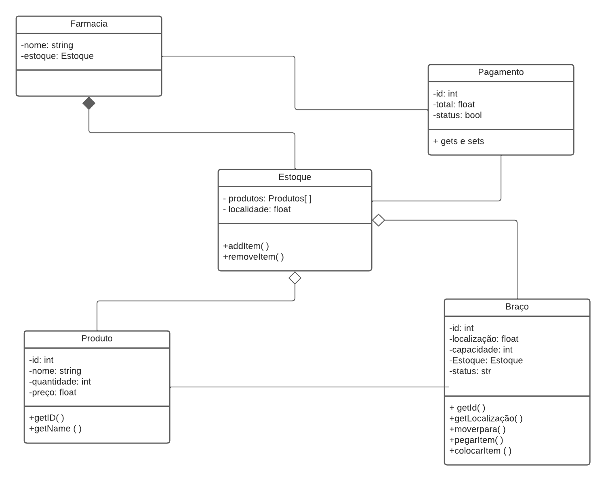

# Introdução

Os diagramas de classes são uma ferramenta poderosa para o design de sistemas orientados a objetos, permitindo que os desenvolvedores visualizem a estrutura de seus sistemas e trabalhem para torná-los mais eficientes e fáceis de manter."

# Diagrama de Classes 

Os diagramas de classes são usados para descrever a estrutura de um sistema orientado a objetos. Ele representa a estrutura estática do sistema em termos de classes, interfaces, atributos, métodos e relacionamentos entre eles.

As classes são representadas como retângulos, com o nome da classe no topo do retângulo. Os atributos são listados abaixo do nome da classe, enquanto os métodos são listados abaixo dos atributos.

## v1.0

O diagrama indica o modelo do projeto. Esse modelo possui diversas classes.

## Classes

Farmacia: representa uma farmácia, com um nome e um objeto do tipo Estoque, que controla o estoque e é responsável por gerenciar a lista de itens.

Estoque: representa  uma lista de objetos do tipo Produto.

Produto: representa um Produto do estoque, com um id, nome, quantidade e preço.

Pagamento: representa o pagamento de um cliente, com um id, um valor total e um status (concluído ou não).

Braço: representa o controlador do braço robótico, com um objeto do tipo Estoque, que controla a lista de itens, uma localização atual e um status (ocupado ou livre). Tem métodos para mover o braço para uma determinada posição, pegar um Produto e colocá-lo em uma posição.

# Referências

- [1] - Pilone, D., & Pitman, N. (2005). UML 2.0 in a Nutshell. O'Reilly Media.
- [2] - Booch, G., Rumbaugh, J., & Jacobson, I. (1999). UML - Guia do Usuário. Bookman.
