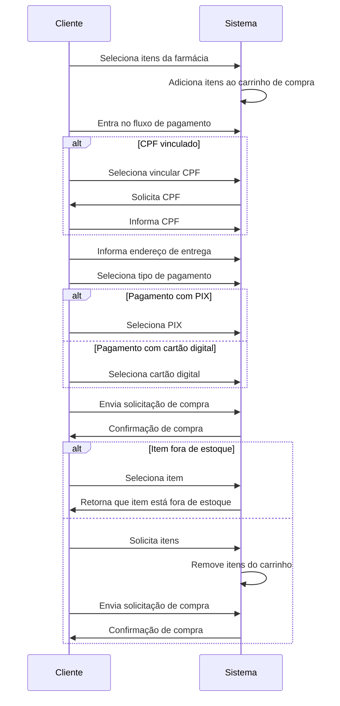
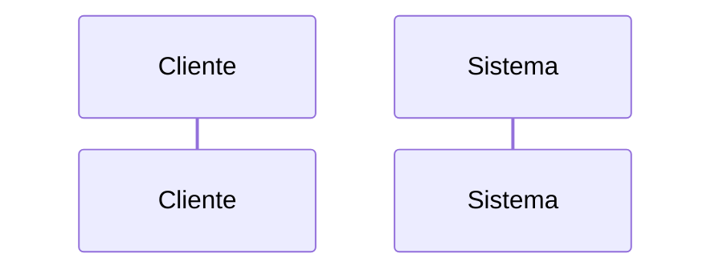
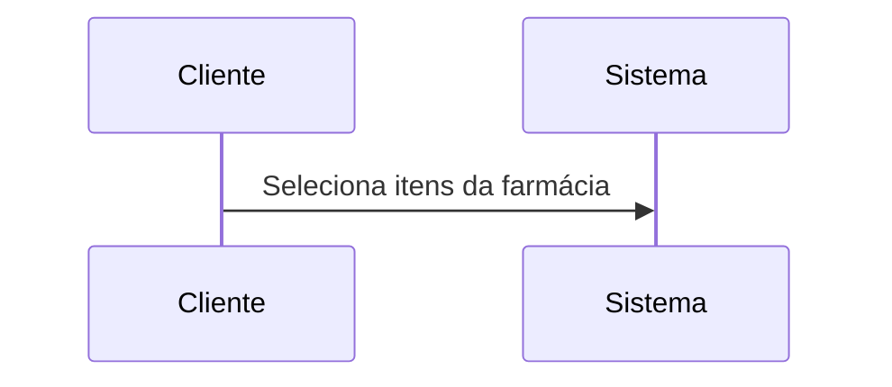
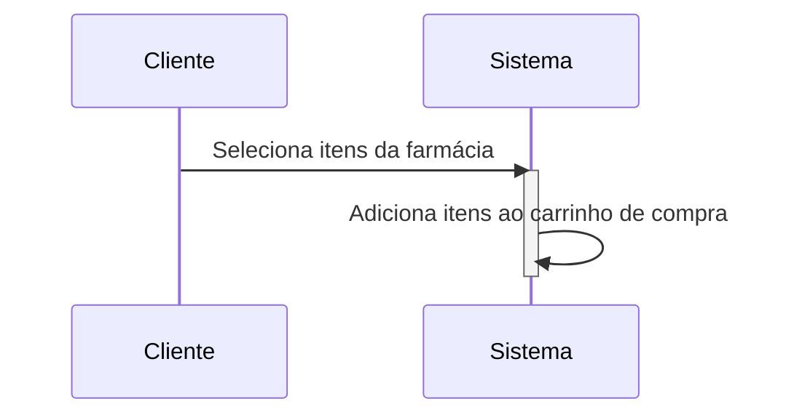
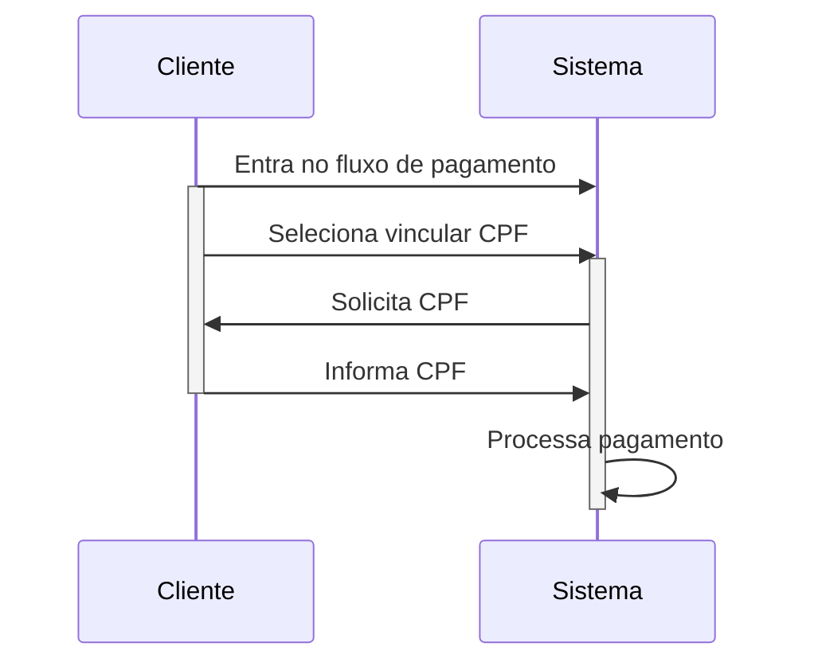
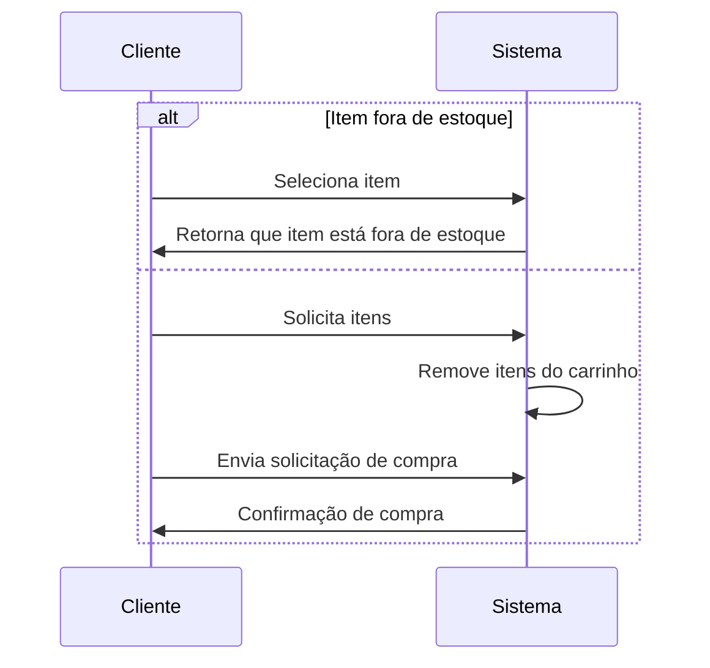
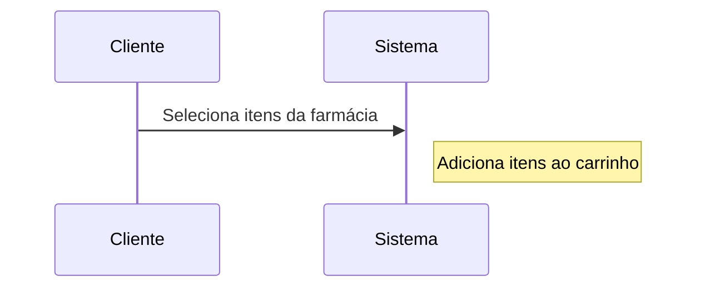

# Diagrama de Sequência

## Introdução

Os diagramas de sequência são uma representação gráfica fundamental para modelar a interação entre objetos em um sistema. Eles fornecem uma visão detalhada da sequência de mensagens trocadas entre os objetos ao longo do tempo, permitindo que se visualize o comportamento dinâmico do sistema em questão. Além disso, os diagramas de sequência são amplamente utilizados na modelagem de processos de negócios, fluxos de trabalho e interações de software[1]. Como resultado, eles são ferramentas valiosas para os desenvolvedores de software e usuários finais, auxiliando na identificação de requisitos funcionais do sistema e na lógica de processamento de dados. Em resumo, os diagramas de sequência são uma parte essencial do processo de engenharia de software, permitindo uma comunicação clara e concisa de ideias e requisitos.

 Figura 1: diagrama de sequência do Projeto Integrador 2, Med Grabber(Fonte: autores, 2023).

## Composição do Diagrama de Sequência

1. **Participante:** Os objetos ou atores envolvidos na interação são representados como participantes no diagrama.[2]

2. **Mensagens:** As mensagens representam a comunicação entre os participantes, indicando as informações trocadas e a ordem em que as mensagens são enviadas.[2]

3. **Linhas de vida:** As linhas de vida representam o tempo durante o qual um participante está ativo no sistema.[2]

4. **Ativação:** A ativação é usada para indicar quando um participante está executando uma tarefa específica em resposta a uma mensagem recebida.[2]

5. **Desvios de condição:** Desvios de condição são usados para indicar fluxos alternativos na sequência de mensagens, dependendo das condições específicas que ocorrem durante a interação.[2]

6. **Anotações:** As anotações são usadas para adicionar informações adicionais ao diagrama, como notas ou explicações sobre a interação.[2]

## Referencias

[1] LU, L.; KIM, D.-K. Required behavior of sequence diagrams: Semantics and conformance. ACM Transactions on Software Engineering and Methodology, v. 23, n. 2, p. 1-28, 2014.
[2] IBM. IBM Rational Software Modeler. Sequence diagrams. Disponível em: https://www.ibm.com/docs/pt-br/rsm/7.5.0?topic=uml-sequence-diagrams. Acesso em: 27 abr. 2023.

<!--Bibitex para referencia

@article{LuLunjin2014Rbos,
  title={Required behavior of sequence diagrams: Semantics and conformance},
  author={Lu, Lunjin and Kim, Dae-Kyoo},
  journal={ACM transactions on software engineering and methodology},
  volume={23},
  number={2},
  pages={1--28},
  year={2014}
}

@misc{IBM,
  title={Sequence diagrams},
  author={IBM},
  howpublished={\url{https://www.ibm.com/docs/pt-br/rsm/7.5.0?topic=uml-sequence-diagrams}},
  year={Acesso em: 27 abr. 2023},
}

-->