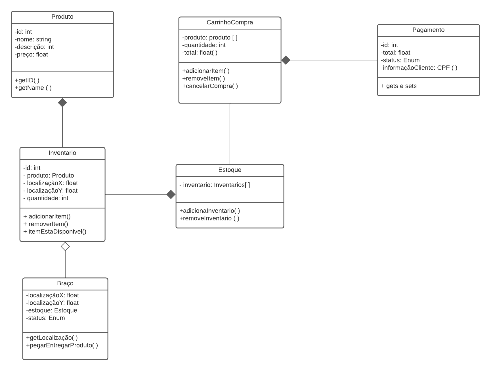

# Introdução

<!-- Adicionar explicação do que é o documento de arquitetura e sua finalidade -->

# Diagrama de Pacote (Front-End)

Diagramas de pacotes são diagramas estruturais comumente usados para simplificar os diagramas de classe complexos e organizar as classes em pacotes. Um grande benefício desse artefato é a visibilidade de alto nível do sistema a ser desenvolvido. Abaixo o grupo criou o diagrama de pacotes referente a aplicação front-end com estruturação na _Clean Architecture_.

## v1.0

O diagrama indica a estrutura do projeto, sendo divida em features, onde cada feature possui as seguintes camadas: infra, data, domain, presentation. Essa estrutura possui diversas classes abstratas, o que entra em acordo com a pasta de testes onde o criamos mocks a partir dessas classes abstratas. A arquitetura do projeto será a _Clean Architecture_, filosofia para design de software, ela separa os elementos do software em anéis de acesso. 
Isso tem como objetivo organizar o código a fim de encapsular as regras de negócio. A principal regra dessa metodologia de design é que anéis mais externos podem ter conhecimento de anéis internos, porém o inverso não é verdade, dessa forma, camadas internas, não conhecem funções/ métodos de camadas externas.

### Infra

Camada que faz o intermédio com à api do sistema, tem a responsabilidade de fazer a request e receber o dado "cru" sem nenhuma tratativa.

### Data

Camada responsável por tratar o dado adquirido pela infra e passá-lo ao domínio já estruturado como é requisitado. Caso o dado não esteja como esperado, será essa camada que levantará uma exceção que irá ser tratada no domínio da aplicação.

### Domain

Camada encapsulado do sistema frontend que não é afetada por mudanças fora dessa camada (com exceções de mudanças na regra do negócio). Nessa camada que é definida os usecases, entidades e falhas específicas do domínio. No caso de necessidade de vários usecases pode-se criar uma rotina que faz uso de um agrupamento de usecases.

# Diagrama de Classes 

Os diagramas de classes são usados para descrever a estrutura de um sistema orientado a objetos. Ele representa a estrutura estática do sistema em termos de classes, interfaces, atributos, métodos e relacionamentos entre eles.

As classes são representadas como retângulos, com o nome da classe no topo do retângulo. Os atributos são listados abaixo do nome da classe, enquanto os métodos são listados abaixo dos atributos.

## v1.0

O diagrama indica o modelo do projeto. Esse modelo possui diversas classes que represemtam as funções do sistema.

## Classes

Inventário: representa uma quatidade de um tipo de produto e sua devida localização, com uma id e um objeto do tipo Produto e uma localização x e outra y para saber sua localidade exata.

Estoque: representa  uma lista de objetos do tipo Inventário.

Produto: representa um Produto do Inventário, com um id, nome, descrição e preço.

Pagamento: representa o pagamento de um cliente, com um id, um valor total, um status (concluído ou não), e uma informação do cliente.

Braço: representa o controlador do braço robótico, com um objeto do tipo Estoque, que controla a lista de itens, uma localização atual e um status (ocupado ou livre). Tem métodos para receber a localização, pegar um Produto e entrega-lo em uma posição.
# Referências

- [1] - Clean architecture in flutter part 1. Disponível em: <https://devmuaz.medium.com/flutter-clean-architecture-series-part-1-d2d4c2e75c47>. Acesso em 23 de Abril de 2023.
- [2] - Designing Software Using Clean Architecture: Domain-Driven Design. Disponível em: <https://betterprogramming.pub/how-to-design-in-clean-architecture-way-part-2-8524e76f2720>. Acesso em 23 de Abril de 2023.
- [3] - Pilone, D., & Pitman, N. (2005). UML 2.0 in a Nutshell. O'Reilly Media.
- [4] - Booch, G., Rumbaugh, J., & Jacobson, I. (1999). UML - Guia do Usuário. Bookman.

## Versionamento
| Versão | Data | Descrição | Autor(es) | 
|---|---|---|---|
| 1.0 | 23/04/2023 | Criação do documento | Mauricio Machado |
| 1.1 | 23/04/2023 | Adição do diagrama de pacotes | Mauricio Machado | 
| 1.2 | 27/04/2023 | Adição do diagrama de classes | Samuel Macedo | 