# Documento de Arquitetura

O documento de arquitetura tem como objetivo apresentar e justificar as decisões em volta da implementação do sistema de software, contemplando o banco de dados, o _backend_, o _frontend_ e as comunicações com outros sistemas como o de eletrônica.

# Definição de Stacks

A implementação do _frontend_ será feita via uso do frmaework Flutter. O Flutter é um framework de código aberto desenvolvido pelo Google que permite criar aplicativos nativos para dispositivos móveis, web e desktop a partir de uma única base de código. Ele utiliza a linguagem de programação Dart. Os benefícios do uso de tal framework são os seguintes:

- Desenvolvimento rápido de UI: O Flutter possui um conjunto abrangente de widgets personalizáveis que permitem criar interfaces de usuário bonitas e responsivas de forma rápida e eficiente. Além disso, as alterações na interface podem ser visualizadas em tempo real, o que acelera o ciclo de desenvolvimento.
- Performance nativa: Ao contrário dos frameworks híbridos, o Flutter permite o desenvolvimento de aplicativos com desempenho nativo. Ele utiliza um mecanismo de renderização próprio que elimina a necessidade de uma camada de ponte entre o código Flutter e as APIs nativas do dispositivo, resultando em um desempenho rápido e suave.
- Código compartilhado: Com o Flutter, é possível escrever o código uma vez e executá-lo em várias plataformas. Isso significa que você pode criar aplicativos para iOS e Android a partir de uma única base de código, economizando tempo e esforço de desenvolvimento.

A implementação do banco de dados será mediante por meio do sistema de gerenciamento de banco de dados relacional, PostgreSQL. A utilização de um banco relacional ao invés de um não relacional foi decidida pelos seguintes motivos:

- Estrutura de dados complexa: Dados do aplicativo têm uma estrutura complexa e relacionamentos bem definidos, um banco de dados relacional é uma escolha adequada. Os bancos de dados relacionais usam tabelas, linhas e colunas para organizar e representar dados relacionados. Eles são ideais para casos em que as relações entre as entidades são importantes, como em sistemas de gerenciamento de conteúdo ou sistemas financeiros.
- Transações ACID: Aplicativo requer transações complexas com garantia de consistência e integridade dos dados, um banco de dados relacional é uma opção sólida. Os bancos de dados relacionais seguem o conceito ACID (Atomicidade, Consistência, Isolamento e Durabilidade), que garante que as transações sejam executadas corretamente, mesmo em cenários de falha.
- Escalabilidade vertical: Os bancos de dados relacionais são adequados para escalabilidade vertical, ou seja, aumentar a capacidade de processamento do servidor, como melhorar o desempenho por meio de hardware mais poderoso ou otimizações de consultas.

Além disso, a utilização de PostgreeSQL ao invés de outro sistema de gerenciamento se deve aos seguintes fatores:

- Modelagem de dados relacional: O PostgreSQL suporta o modelo relacional, permitindo que você defina tabelas, colunas e relacionamentos entre elas. Você pode criar esquemas complexos e aplicar restrições de integridade para garantir a consistência dos dados.
- Suporte a consultas complexas: O PostgreSQL oferece suporte a consultas SQL poderosas e sofisticadas, permitindo realizar operações complexas de junção, agregação e filtragem de dados. Ele também suporta funções, subconsultas, junções externas e outros recursos avançados para manipulação de dados.
- Extensibilidade: O PostgreSQL permite estender suas funcionalidades por meio de extensões. Isso significa que você pode adicionar recursos personalizados, tipos de dados, funções e até mesmo criar suas próprias linguagens de programação procedurais, como PL/pgSQL, PL/Python, PL/Java, entre outras.
- Confiabilidade e escalabilidade: O PostgreSQL é conhecido por sua robustez e estabilidade. Ele é projetado para ser resiliente a falhas, oferece suporte a replicação síncrona e assíncrona para alta disponibilidade e pode lidar com grandes volumes de dados e cargas de trabalho intensivas.
- Segurança avançada: O PostgreSQL oferece uma série de recursos de segurança, incluindo autenticação de usuário, criptografia de dados em trânsito e em repouso, controle de acesso baseado em papéis (RBAC) e auditoria de eventos.
- Suporte a tipos de dados avançados: Além dos tipos de dados padrão, o PostgreSQL oferece suporte a tipos de dados avançados, como arrays, JSON, geometria espacial (PostGIS), dados binários e outros tipos personalizados.

<!-- Escrever aqui sobre a stack do backend: linguagem e motivos do uso da linguagem como pacotes que oferecem suporte a comunicação com rasp - explicação de decisões sobre implementação (uso de kafka, MVC e afins devem ser feitas na parte de Justificativa de decisões) Não esquecer de falar sobre docker no backend -->

A implementação do *backend* será seguindo uma arquitetura de microsserviços baseados em eventos. Para isso decidimos utilizar Python como linguagem de desenvolvimento e Apache Kafka para fazer a comunicação baseada em eventos entre microsserviços.

A arquitetura de microsserviços permite que você dimensione e gerencie componentes independentemente uns dos outros, além de oferecer uma maior disponibilidade do sistema. Python possui bibliotecas e ferramentas como o asyncio e o gevent, que permitem criar microsserviços assíncronos e escaláveis. Além disso, a natureza independente dos microsserviços em Python ajuda a tornar todo o sistema mais resiliente, pois uma falha em um serviço não afeta diretamente os outros.

Cada microsserviço será responsável por ser sua única fonte de verdade ou _Single Source of Truth_ (SSOT), ou seja, eles serão responsáveis por gerenciar os dados dentro de suas responsabilidades para garantir a confiabilidade dos mesmos. Para atender a esse requisito arquitetural, todos os microsserviços irão utilizar o mesmo banco de dados.

Python é conhecido por sua capacidade de se integrar bem com outras tecnologias e sistemas. Você pode usar bibliotecas Python para se comunicar com bancos de dados, sistemas de mensageria e serviços de armazenamento em nuvem por exemplo.

Em relação à comunicação de microsserviços baseados em eventos, foi escolhido Apache Kafka para realizar a comunicação pois é um software _open-source_ que implementa sistemas distribuidos para _streaming_ de dados para múltiplas plataformas. Fazendo assim que haja uma comunicação em tempo-real entre _front-end_, os microsserviços e o software embarcado ao braço robótico. 

O Apache Kafka soluciona um grande problema relacionado à processamento de dados que ocorrem de forma assíncrona: essa tecnologia funciona de forma similar a uma fila de mensagens, e por isso é possível manter uma consistência entre os dados independente do momento em que foram modificados, pois os pacotes de dados não se perdem caso ocorra algum erro, fazendo assim que os microsserviços possam tentar obter a mesma mensagem multiplas vezes caso algum erro ocorra como por exemplo algum microsserviço no ecossistema não estar funcionando.

Um dos microsserviços não atuará baseado em eventos pois não haverá necessidade em transição de dados a ponto que os outros microsserviços precisam atualizar seus estados em tempo real. Este irá implementar uma API REST utilizando o framework FastAPI.

# Diagrama de implementação

O Diagrama de Implementação é uma representação visual que mostra a estrutura física da arquitetura de um sistema de software. Ele se concentra na organização do ambiente físico em que o software será implantado e executado, incluindo o hardware necessário, como computadores pessoais e servidores que suportarão o sistema. O diagrama é a visão mais tangível da UML e ajuda a entender como os diferentes componentes do sistema se relacionam entre si em termos físicos.

O Diagrama de Implementação será usado para descrever a conexão das máquinas e os protocolos de comunicação utilizados para transferir informações. O objetivo é obter uma visão clara da implementação do software, o que facilita o processo de desenvolvimento, uma vez que a modelagem é focada em um nível arquitetural mais específico em relação ao hardware. Com o Diagrama de Implementação, é possível entender como os componentes do sistema se interconectam fisicamente e quais recursos de hardware são necessários para executar o software. Dessa forma, é possível identificar e resolver problemas de desempenho ou escalabilidade antes de implementar o sistema, o que pode economizar tempo e recursos. O diagrama também ajuda a comunicar a arquitetura do sistema para as partes interessadas de forma clara e eficaz.

## v1.0

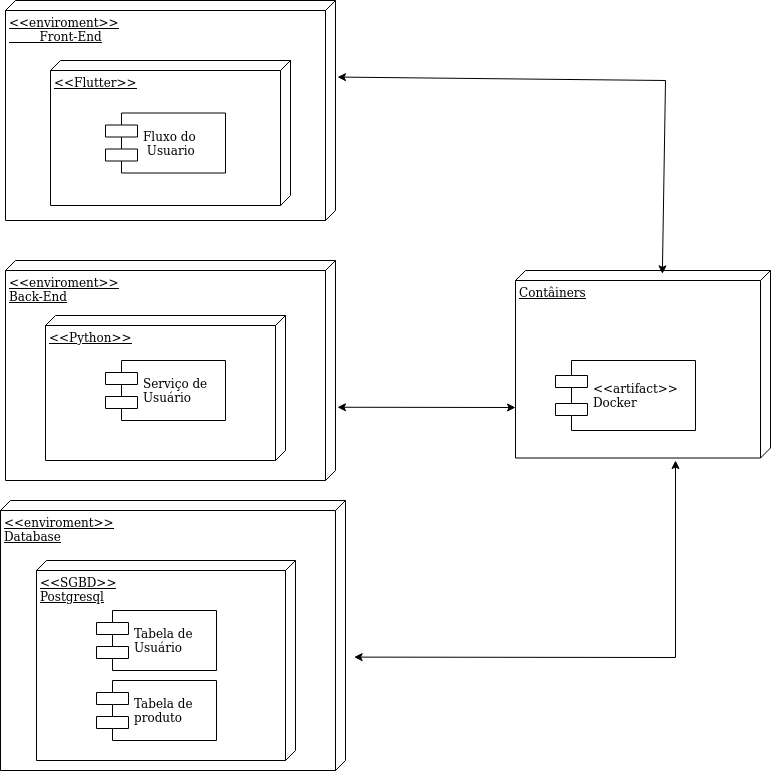

A primeira versão desse diagrama se concentrou em um nível de desenvolvimento e tangibilizou uma implantação mais simples. Partindo dessa perspectiva, temos o servidor da aplicação englobando o ambiente do Front End, Back End e o Banco de Dados rodando localmente.

## v2.0

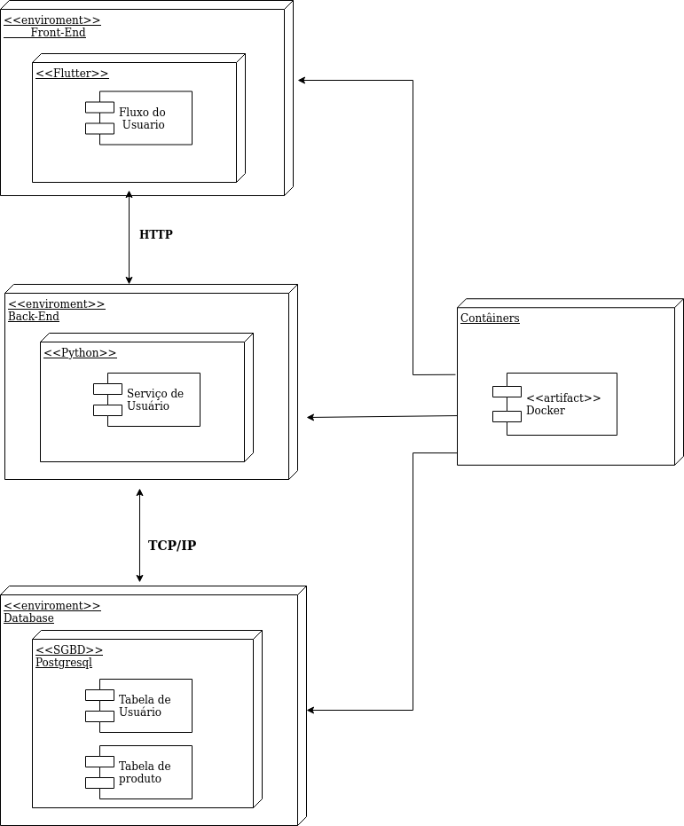

A segunda versão desse diagrama apresenta todos os ambientes estão dentro do container do Docker. O acesso é feito pelo protocolo HTTP a partir de navegadores e do protocolo TCP/IP para comunicação com o Banco de Dados.

# Diagrama de Pacote (Front-End)

Diagramas de pacotes são diagramas estruturais comumente usados para simplificar os diagramas de classe complexos e organizar as classes em pacotes. Um grande benefício desse artefato é a visibilidade de alto nível do sistema a ser desenvolvido. Abaixo o grupo criou o diagrama de pacotes referente a aplicação front-end com estruturação na _Clean Architecture_.

## v1.0

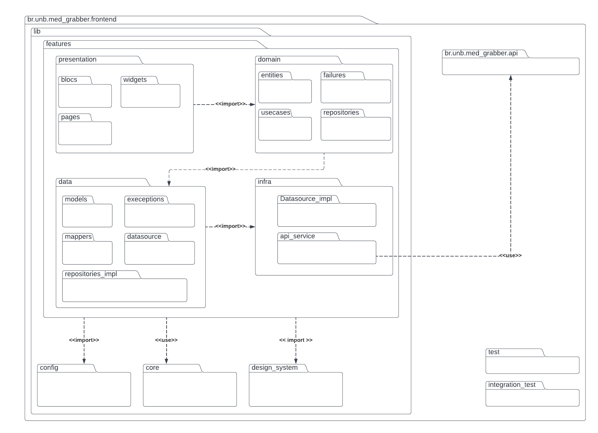

O diagrama indica a estrutura do projeto, sendo divida em features, onde cada feature possui as seguintes camadas: infra, data, domain, presentation. Essa estrutura possui diversas classes abstratas, o que entra em acordo com a pasta de testes onde o criamos mocks a partir dessas classes abstratas. A arquitetura do projeto será a _Clean Architecture_, filosofia para design de software, ela separa os elementos do software em anéis de acesso. 
Isso tem como objetivo organizar o código a fim de encapsular as regras de negócio. A principal regra dessa metodologia de design é que anéis mais externos podem ter conhecimento de anéis internos, porém o inverso não é verdade, dessa forma, camadas internas, não conhecem funções/ métodos de camadas externas.

### Infra

Camada que faz o intermédio com à api do sistema, tem a responsabilidade de fazer a request e receber o dado "cru" sem nenhuma tratativa.

### Data

Camada responsável por tratar o dado adquirido pela infra e passá-lo ao domínio já estruturado como é requisitado. Caso o dado não esteja como esperado, será essa camada que levantará uma exceção que irá ser tratada no domínio da aplicação.

### Domain

Camada encapsulado do sistema frontend que não é afetada por mudanças fora dessa camada (com exceções de mudanças na regra do negócio). Nessa camada que é definida os usecases, entidades e falhas específicas do domínio. No caso de necessidade de vários usecases pode-se criar uma rotina que faz uso de um agrupamento de usecases.

# Diagrama de Pacote (Back-end)

Diagrama de pacotes são diagramas estruturais comumente usados para simplificar os diagramas de classe complexos e organizar as classes em pacotes. Um grande benefício desse artefato é a visibilidade de alto nível do sistema a ser desenvolvido. Abaixo o grupo criou o diagrama de pacotes referente a aplicação back-end com estruturação na _Clean Architecture_.

## v1.0

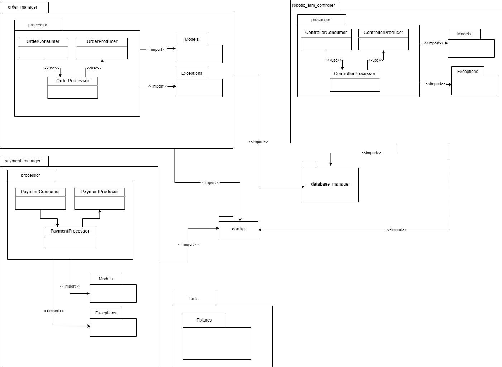

Esta versão do diagrama de pacotes v1.0 foi refeita para contemplar conceitos que envolvam o administrador do sistema.

    
Os componentes com o sufixo 'Consumer' e 'Producer' são respectivamente responsáveis por se conectarem com o sistema Apache Kafka para enviar e receber mensagens de outros sistemas e/ou pacotes.

Os componentes com o sufixo 'Processor' têm a responsabilidade de implementar a lógica do pacote, sem se preocupar em como a comunicação com outros sistemas e/ou pacotes é feita.

Os pacotes 'Models' são responsáveis por modelos de objetos a serem utilizados.

Os pacotes 'Exceptions' são responsáveis por especificar excessões para que erros não sejam tratados de forma genérica.

### order_manager

Tem a responsabilidade de gerenciar as ordens de compra, fazendo a comunicação com o banco de dados e com o sistema de pagamento.

### payment_manager

Tem a responsabilidade de gerenciar e verificar os pagamentos.

### robotic_arm_controller

Tem a responsabilidade de gerar e enviar os comandos para o braço robótico.

### database_manager

Tem a responsabilidade de realizar operações de leitura, registro, atualização e remoção de dados no banco de dados.

### config

Tem a responsabilidade de armazenar valores de configurações do sistema.

### tests

Tem a responsabilidade de armazenar os testes unitários e de integração do sistema.

## v2.0

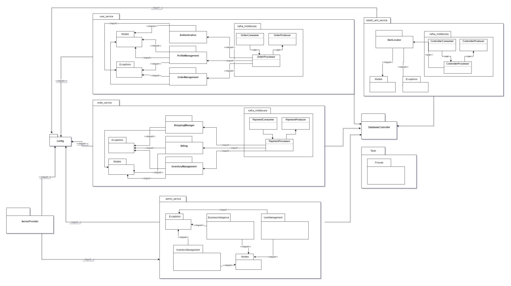

O diagrama de pacotes do backend foi pensado para respeitar uma estrutura **Single Source of Truth** (SSOT), onde todos os dados deverão ser guardados em uma mesma fonte,
e por isso todos os pacotes irão utilizar o pacote `DatabaseController` para se conectar e realizar as operações necessárias no banco de dados.

A escolha de usar Apache Kafka para construir uma arquitetura de microsserviços baseado em eventos é devido à consistência de dados no sistema.
Em sistemas distribuídos como uma arquitetura baseada em microsserviços, manter uma consistência forte pode ser um desafio devido à latência da rede e ao potencial de falhas.
É aqui que os microsserviços baseados em eventos são mais importantes.
Ao usar um modelo orientado a eventos, o sistema pode manter uma consistência dos dados pela forma em que o sistema interage com eventos.
O microsserviço SSOT emite eventos sempre que os dados são alterados.
Outros microsserviços escutam esses eventos e atualizam, caso necessário, seus próprios dados.
Esse modelo ajuda a manter um alto nível de consistência de dados em todo o sistema.

## Estruturas em comuns entre os pacotes

#### kafka_middleware

Essa estrutura contempla conexão com o servidor Kafka, onde terá um objeto `Consumer` que irá consumir dados dos tópicos, terá `Producer` que irá publicar dados nos tópicos e o `Processor` que irá chamar os pacotes relacionados às regras de negócio.

#### Models

Contempla os modelos de dados a serem utilizados pelos pacotes.

#### Exceptions

Contempla excessões para um melhor tratamento e identificação de erros.

## Descrição dos pacotes

#### user_service

Contempla todas as operações que envolvam ações do usuário com seu prório perfil, autenticação e/ou histórico de compras.

#### order_service

Contempla todas as operações que envolvam ordem de pedidos.

#### robotic_arm_service

Contempla todas as operações necessárias para obter as informações pertinentes a serem enviadas ao braço robótico, como por exemplo
a localização dos itens que o braço robótico irá pegar.

#### admin_service

Contempla todas as operações e requisições que o administrador do sistema realiza no sistema.
Operações como verificação e atualização do estoque, obtenção de dados estatísticos das vendas e gerenciamento de usuários.

#### ServerProvider

Contempla uma API REST para acesso às operações de administrador.

#### DatabaseController

Contempla funções necessárias para acesso ao banco de dados que serão utilizadas por outros pacotes, que não precisarão ter sua própria forma de acesso ao banco.

#### Tests

Contempla os testes que serão executados no sistema.

##### Fixtures

Contempla dados preparados para serem utilizados como input os testes.

#### config

Contempla valores padrão de configurações que poderão ser sobrescritos por variáveis de ambiente.

## Diagrama de Sequência

Os diagramas de sequência são uma representação gráfica fundamental para modelar a interação entre objetos em um sistema. Eles fornecem uma visão detalhada da sequência de mensagens trocadas entre os objetos ao longo do tempo, permitindo que se visualize o comportamento dinâmico do sistema em questão. Além disso, os diagramas de sequência são amplamente utilizados na modelagem de processos de negócios, fluxos de trabalho e interações de software[3]. Como resultado, eles são ferramentas valiosas para os desenvolvedores de software e usuários finais, auxiliando na identificação de requisitos funcionais do sistema e na lógica de processamento de dados. Em resumo, os diagramas de sequência são uma parte essencial do processo de engenharia de software, permitindo uma comunicação clara e concisa de ideias e requisitos.

### Diagrama do aplicativo de compras

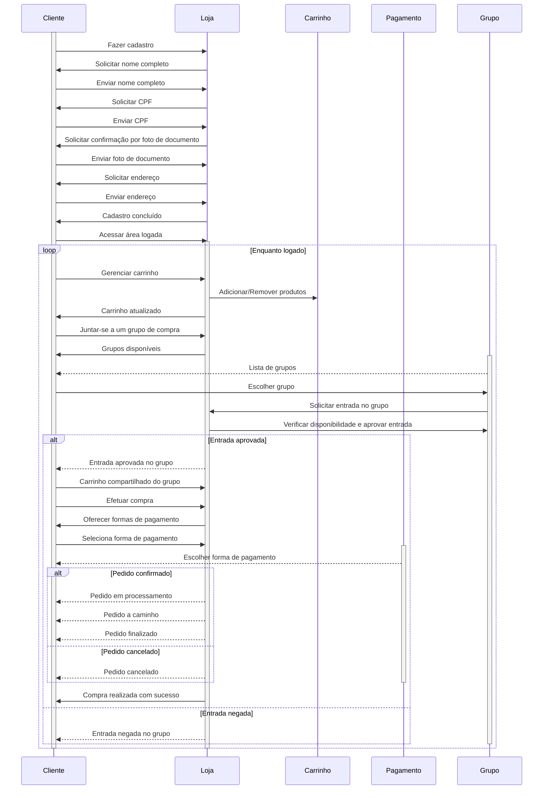

 Figura 3: diagrama de sequência para o aplicativo de compras do Projeto Integrador 2, Med Grabber(Fonte: autores, 2023).

Descrevendo o fluxo apresentado, o cliente começa fazendo o cadastro, fornecendo informações como nome completo, CPF, confirmação por foto de documento e endereço. Após o cadastro, o cliente faz login na loja e pode gerenciar seu carrinho de compras, adicionando ou removendo produtos. Em seguida, o cliente pode escolher efetuar a compra, onde são oferecidas três formas de pagamento: cartão de crédito, cartão de débito e Pix. Além disso, o diagrama foi atualizado para incluir a funcionalidade de compra em grupo, onde o cliente pode se juntar a outros usuários para realizar uma compra conjunta, compartilhando o carrinho de compras. A loja verifica a disponibilidade e aprova a entrada do cliente no grupo, permitindo que a compra seja concluída.

### Diagrama do aplicativo de estoque

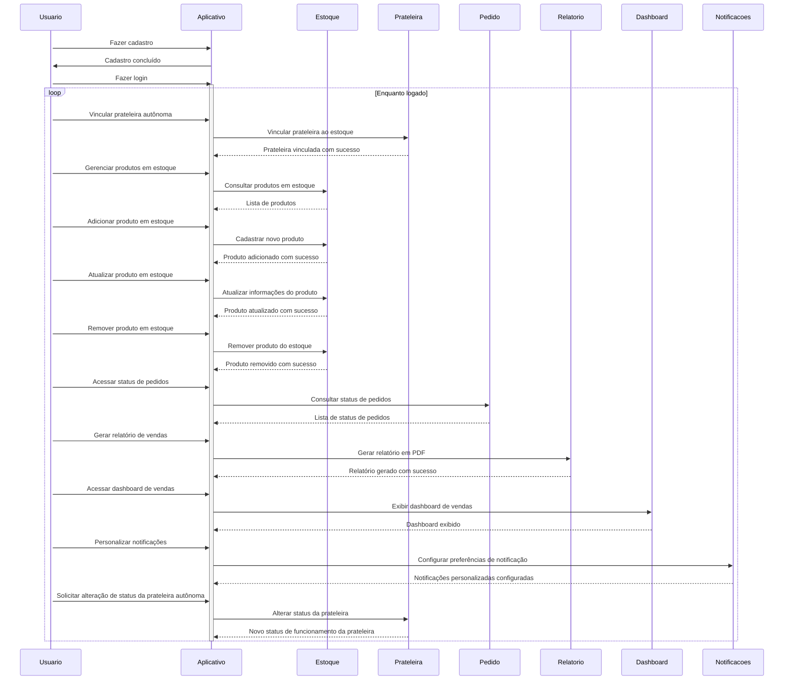

 Figura 4: diagrama de sequência para o aplicativo de estoques do Projeto Integrador 2, Med Grabber(Fonte: autores, 2023).

Descrevendo o fluxo apresentando na figura, O usuário realiza o cadastro e faz login no aplicativo. Em seguida, o usuário pode vincular uma prateleira autônoma ao aplicativo do estoque. Após a vinculação, o usuário pode gerenciar os produtos em estoque, realizando ações como adicionar, consultar, atualizar e remover produtos. O usuário também pode acessar o status dos pedidos existentes. Além disso, o aplicativo permite a geração de relatórios de vendas em formato PDF e exibe um dashboard de vendas. O usuário pode personalizar as notificações de acordo com suas preferências. Por fim, o usuário pode solicitar a alteração do status de funcionamento da prateleira autônoma, e o aplicativo informa o status atual conforme necessário.

### Composição do Diagrama de Sequência

1. **Participante:** Os objetos ou atores envolvidos na interação são representados como participantes no diagrama.[4]

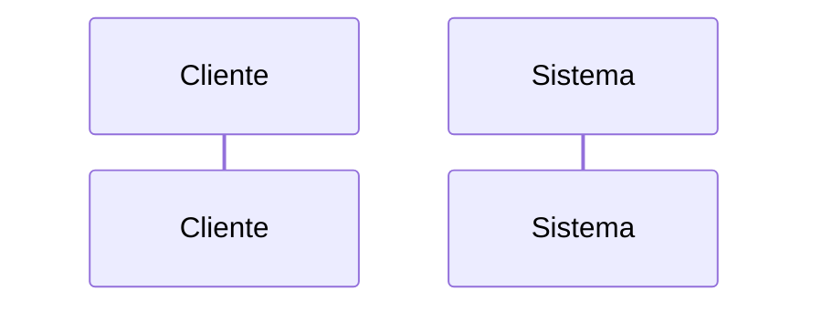

 Figura 5: exemplo de participante, composição do diagrama de sequência(Fonte: autores, 2023).

1. **Mensagens:** As mensagens representam a comunicação entre os participantes, indicando as informações trocadas e a ordem em que as mensagens são enviadas.[2]

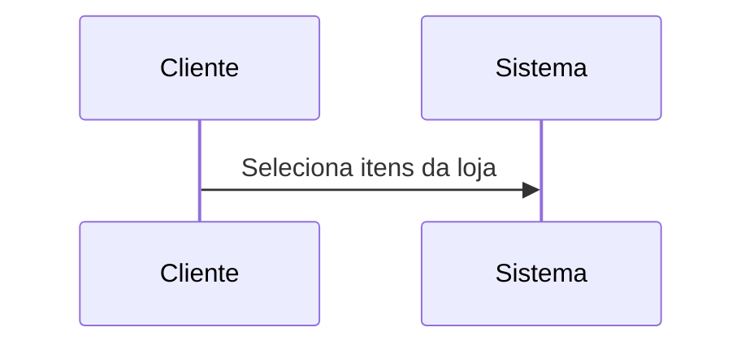

 Figura 6: exemplo de mensagem, composição do diagrama de sequência(Fonte: autores, 2023).

3. **Linhas de vida:** As linhas de vida representam o tempo durante o qual um participante está ativo no sistema.[4]

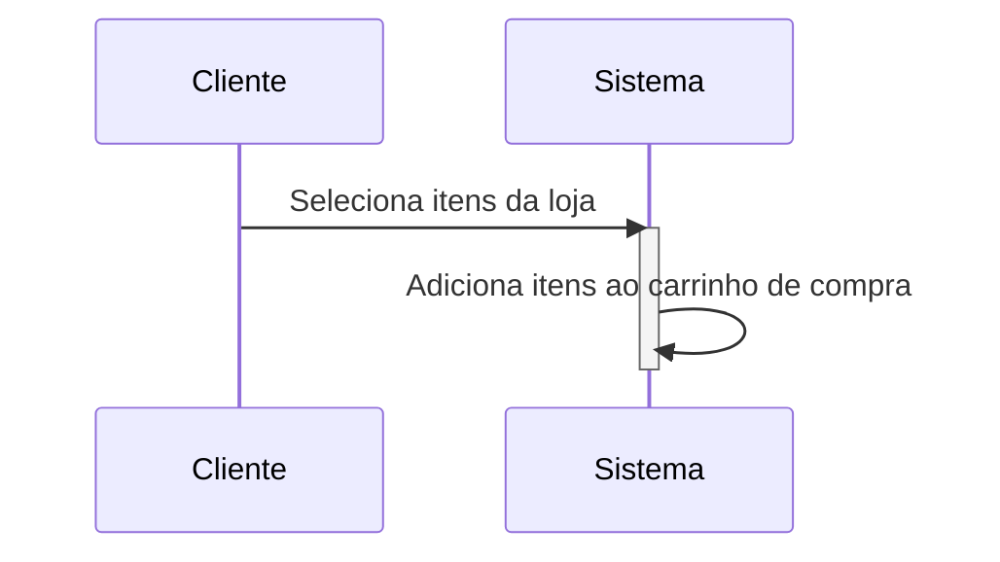

 Figura 7: exemplo de linha de vida, composição do diagrama de sequência(Fonte: autores, 2023).

4. **Ativação:** A ativação é usada para indicar quando um participante está executando uma tarefa específica em resposta a uma mensagem recebida.[4]

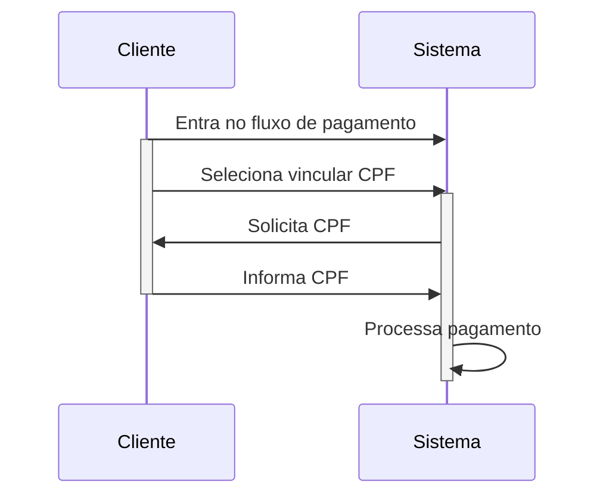

 Figura 8: exemplo de ativação, composição do diagrama de sequência(Fonte: autores, 2023).

5. **Desvios de condição:** Desvios de condição são usados para indicar fluxos alternativos na sequência de mensagens, dependendo das condições específicas que ocorrem durante a interação.[4]

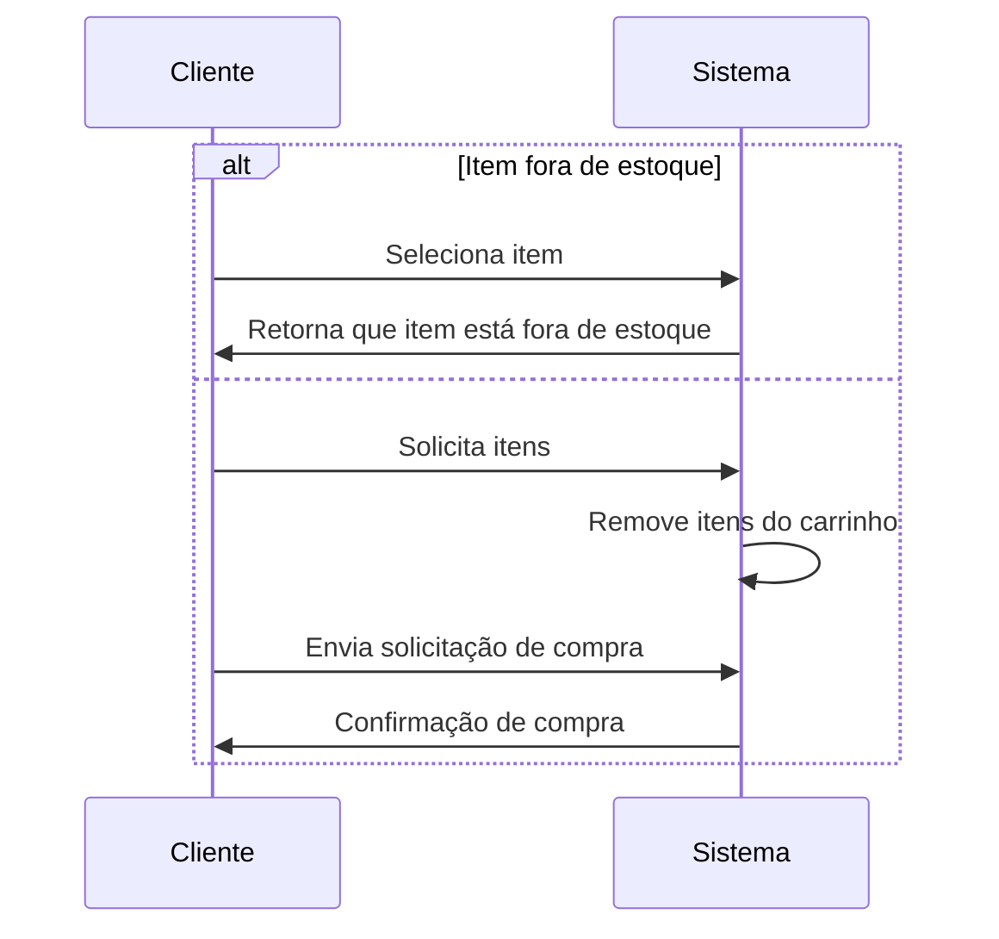

 Figura 9: exemplo de desvio de condicional, composição do diagrama de sequência(Fonte: autores, 2023).

6. **Anotações:** As anotações são usadas para adicionar informações adicionais ao diagrama, como notas ou explicações sobre a interação.[4]

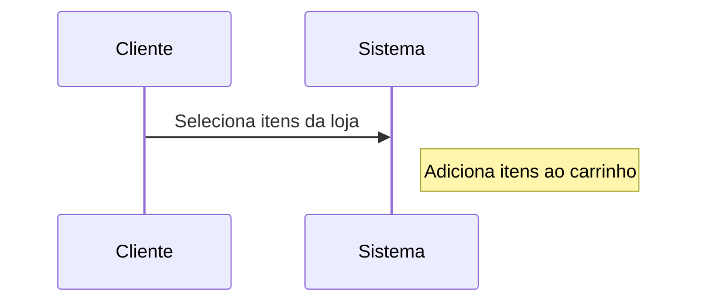

 Figura 10: exemplo de anotações, composição do diagrama de sequência(Fonte: autores, 2023).

<!--Bibitex para referencia

@article{LuLunjin2014Rbos,
  title={Required behavior of sequence diagrams: Semantics and conformance},
  author={Lu, Lunjin and Kim, Dae-Kyoo},
  journal={ACM transactions on software engineering and methodology},
  volume={23},
  number={2},
  pages={1--28},
  year={2014}
}

@misc{IBM,
  title={Sequence diagrams},
  author={IBM},
  howpublished={\url{https://www.ibm.com/docs/pt-br/rsm/7.5.0?topic=uml-sequence-diagrams}},
  year={Acesso em: 27 abr. 2023},
}

-->

# Diagrama de Classes

Os diagramas de classes são usados para descrever a estrutura de um sistema orientado a objetos. Ele representa a estrutura estática do sistema em termos de classes, interfaces, atributos, métodos e relacionamentos entre eles.

As classes são representadas como retângulos, com o nome da classe no topo do retângulo. Os atributos são listados abaixo do nome da classe, enquanto os métodos são listados abaixo dos atributos.

## v2.0

O diagrama indica o modelo do projeto. Esse modelo possui diversas classes que representam as funções do sistema.

## Classes

Inventário: representa a quatidade de um tipo de produto e sua devida localização, com uma id e um objeto do tipo Produto e uma localização x e outra y para saber sua localidade exata.

Estoque: representa uma lista de objetos do tipo inventário.

Produto: representa um Produto do Inventario, com um id, nome, descrição e preço.

Pagamento: representa o pagamento de um cliente, com um id, um valor total, um status (concluído ou não), e uma informação do cliente.

Carrinho: representa os itens e valores dos produtos que o cliente escolheu, com objeto do tipo produto que controla a lista de produto, uma quantidade e o total.

CarrinhoGrupo: Representa uma classe filho da Carrinho com as caracteristicas para compras em grupo.

Pedidos: Uma classe pedidos que é responsável de fazer o controle de todos os pedidos feitos no sistema.

Usuário: Uma classe pai cliente que representa todo o cadastro do publico que utilizar o sistema.

Consumidor: Uma classe filho da classe Usuário com objeto de controlar o Carrinho e o pagamento.

Estoquista: Uma classe filho da classe Usuário responsável de fazer o controle do Estoque, como um usuário Administrador.

# Diagrama de entidade relacional

Um Diagrama de Entidade-Relacionamento (DER) é uma representação gráfica que ilustra as entidades, atributos e relacionamentos entre as entidades de um modelo de dados.O DER permite que os desenvolvedores de banco de dados visualizem e compreendam as relações entre as diferentes entidades em um sistema, e isso pode ajudar a garantir que o modelo de dados seja completo, preciso e fácil de entender.

# v1.0

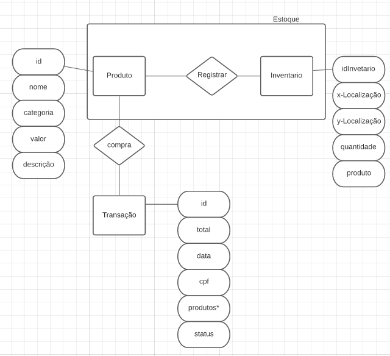

O diagrama indica a estrutura do banco que será utilizado no projeto, sendo dividido em 3 tabelas (Produto,Inventario,Transações) onde cada uma contem as colunas nescessarias para o controle do estoque e compra de cada produto.

## Entidades

Produto: representa os produtos oferecidos e contém os atributos id (identificador único do produto), nome, categoria, valor, descrição.

Inventario: representa as informações de cada produto e contém os atributos de idInventario (identificador único do produto dentro do inventario), x-Localização (posição no eixo x do produto), y-Localização (posição no eixo y do produto),quantidade, produto.

Transação: representa as informações de transações feitas e contém os atributos id(identificador único do produto), total, data, cpf, produtos (lista com todos os produtos da compra), status.

# Modelo Relacional

O modelo relacional é uma representação do banco de dados utilizando tabelas, colunas e chaves primárias e estrangeiras, que permitem armazenar e relacionar informações de forma organizada e eficiente.

# v1.0

# Tabelas

## Produto

- idProduto (chave primária)
- nome
- valor
- categoria
- descrição

# Inventário

- idInventario (chave primária)
- idProduto (chave estranjeira)
- xLocalização
- yLocalização
- quantidade

# Transações

- idTransação (chave primária)
- total
- data
- cpf
- status

# Itens_da_compra

- idItens (chave primária)
- idTransação (chave estranjeira)
- idProduto (chave estranjeira)

Cada tabela possui uma chave primária para identificar cada registro de forma única.

Chaves Estrangeiras:

As chaves estrangeiras são utilizadas para relacionar informações entre as tabelas. As chaves estrangeiras são definidas em uma tabela e referenciam a chave primária de outra tabela.

# Justificativa de Decisões

Utilizar a Clean Architecture (Arquitetura Limpa) em um projeto frontend traz diversos benefícios, especialmente em relação a testes e encapsulamento do domínio da aplicação. Os benefícios são:

- Testabilidade: A Clean Architecture promove a testabilidade do código. Ao separar claramente as responsabilidades em camadas distintas, como a camada de domínio, a camada de aplicação e a camada de interface do usuário, é mais fácil isolar e testar cada uma dessas camadas de forma independente. Isso permite que você escreva testes unitários mais granulares, sem depender de componentes externos ou do ambiente de execução.
- Encapsulamento do domínio: A Clean Architecture enfatiza o encapsulamento do domínio da aplicação. A camada de domínio contém as regras de negócio e lógica de negócio essenciais para o funcionamento da aplicação. Ao manter essa camada isolada e independente das camadas externas, como a camada de interface do usuário e a camada de infraestrutura, você garante que as regras de negócio permaneçam coesas, independentes e mais fáceis de serem modificadas sem afetar outras partes do sistema.
- Baixo acoplamento: A Clean Architecture busca minimizar o acoplamento entre as diferentes camadas do sistema. Ao definir interfaces claras e utilizar inversão de dependência (Dependency Inversion Principle), as camadas de mais alto nível dependem apenas de abstrações, não de implementações concretas. Isso promove uma maior flexibilidade, pois você pode substituir componentes facilmente sem afetar outras partes do sistema.
- Facilidade de evolução e manutenção: Com a Clean Architecture, é mais fácil evoluir e manter o sistema ao longo do tempo. A separação clara de responsabilidades e o baixo acoplamento permitem que você faça alterações em uma camada sem afetar outras partes do sistema. Isso reduz o risco de efeitos colaterais indesejados e torna a manutenção e a evolução do código mais simples e seguras.
- Reaproveitamento de código: A Clean Architecture facilita o reaproveitamento de código. Com a separação das responsabilidades em camadas distintas, você pode reutilizar componentes, como regras de negócio ou serviços, em diferentes partes do sistema ou até mesmo em outros projetos, sem a necessidade de modificá-los. Isso aumenta a produtividade e a consistência do desenvolvimento.

# Referências

- [1] - Clean architecture in flutter part 1. Disponível em: <https://devmuaz.medium.com/flutter-clean-architecture-series-part-1-d2d4c2e75c47>. Acesso em 23 de Abril de 2023.
- [2] - Designing Software Using Clean Architecture: Domain-Driven Design. Disponível em: <https://betterprogramming.pub/how-to-design-in-clean-architecture-way-part-2-8524e76f2720>. Acesso em 23 de Abril de 2023.
- [3] LU, L.; KIM, D.-K. Required behavior of sequence diagrams: Semantics and conformance. ACM Transactions on Software Engineering and Methodology, v. 23, n. 2, p. 1-28, 2014.
- [4] IBM. IBM Rational Software Modeler. Sequence diagrams. Disponível em: https://www.ibm.com/docs/pt-br/rsm/7.5.0?topic=uml-sequence-diagrams. Acesso em: 27 abr. 2023.
- [5] - Pilone, D., & Pitman, N. (2005). UML 2.0 in a Nutshell. O'Reilly Media.
- [6] - Booch, G., Rumbaugh, J., & Jacobson, I. (1999). UML - Guia do Usuário. Bookman.
- [7] - Pilone, D., & Pitman, N. (2005). UML 2.0 in a Nutshell. O'Reilly Media.
- [8] - Booch, G., Rumbaugh, J., & Jacobson, I. (1999). UML - Guia do Usuário. Bookman.
- [9] - TEORY, T. LIGHTSTONE, S., NADEAU, T. and JAGADISH, H. V. Database Modeling and Design: Logical Design. USA: Morgan Kaufmann, 2005
- [10] - SILBERSCHATZ, A., KORTH, H. F. e SUDARSHAN, S. Sistemas de Bancos de Dados. Editora Campus. 2006.
- [11] -Diagramas de Implementação. Disponível em: https://www.ibm.com/docs/pt-br/rsas/7.5.0?topic=topologies-deployment-diagrams. Acesso em: 26 de abr. 2022
- [12] - Diagrama de Implantação .Disponível em: https://creately.com/blog/pt/diagrama/tutorial-do-diagrama-de-implantacao/. Acesso em: 26 de abr. 2022
- [13] - VISUAL PARADIGM. UML Deployment Diagram. Disponível em: https://www.visual-paradigm.com/guide/uml-unified-modeling-language/uml-deployment-diagram/. Acesso em: 27 abr. 2023.

## Versionamento

| Versão | Data       | Descrição                                 | Autor(es)        |
| ------ | ---------- | ----------------------------------------- | ---------------- |
| 1.0    | 23/04/2023 | Criação do documento                      | Mauricio Machado |
| 1.1    | 23/04/2023 | Adição do diagrama de pacotes             | Mauricio Machado |
| 1.2    | 27/04/2023 | Adição do diagrama de classes             | Samuel Macedo    |
| 1.3    | 27/04/2023 | Adição do diagrama de entidade relacional | Pedro Moraes     |
| 1.4    | 27/04/2023 | Adição do modelo relacional               | Pedro Moraes     |
| 1.5    | 28/04/2023 | Adição do diagrama de sequência           | Natanael Filho   |
| 1.6    | 28/04/2023 | Correção e Revisaão do Documento Geral    | Davi Mateus      |
| 1.7    | 28/04/2023 | Adição do diagrama de implementação       | Sávio Cunha      |
| 2.0    | 15/05/2023 | Adição do diagrama de classes V2          | Samuel Macedo    |
| 2.1    | 25/05/2023 | Adição justificativa diagramas            | Mauricio Machado |
