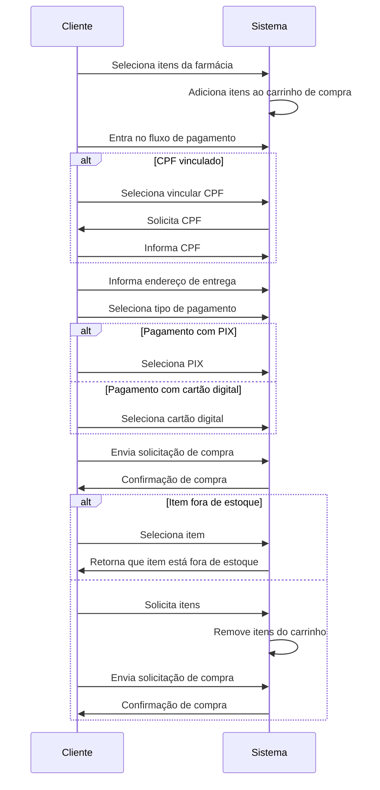
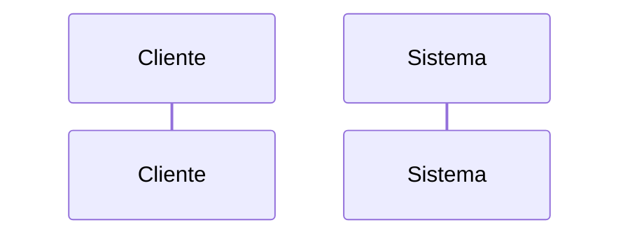
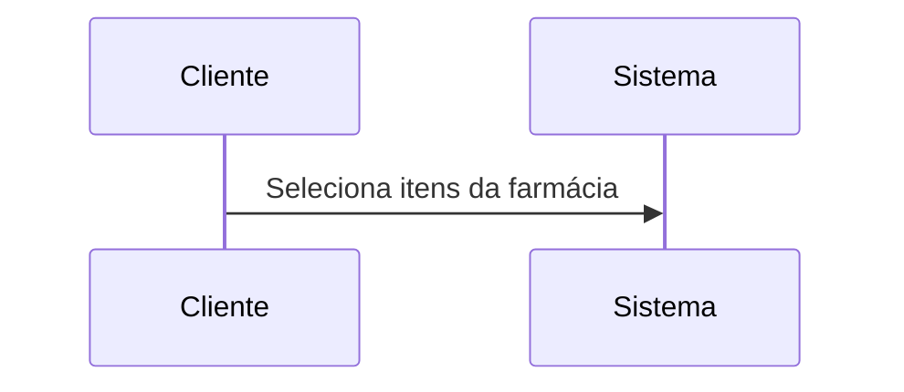
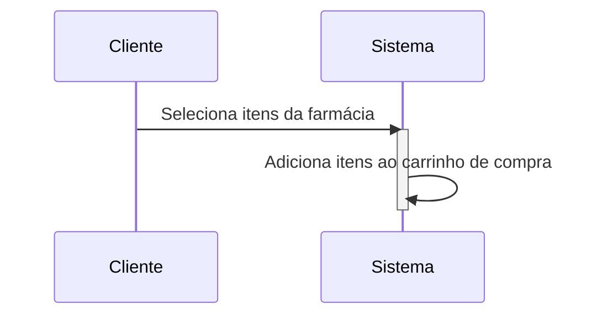
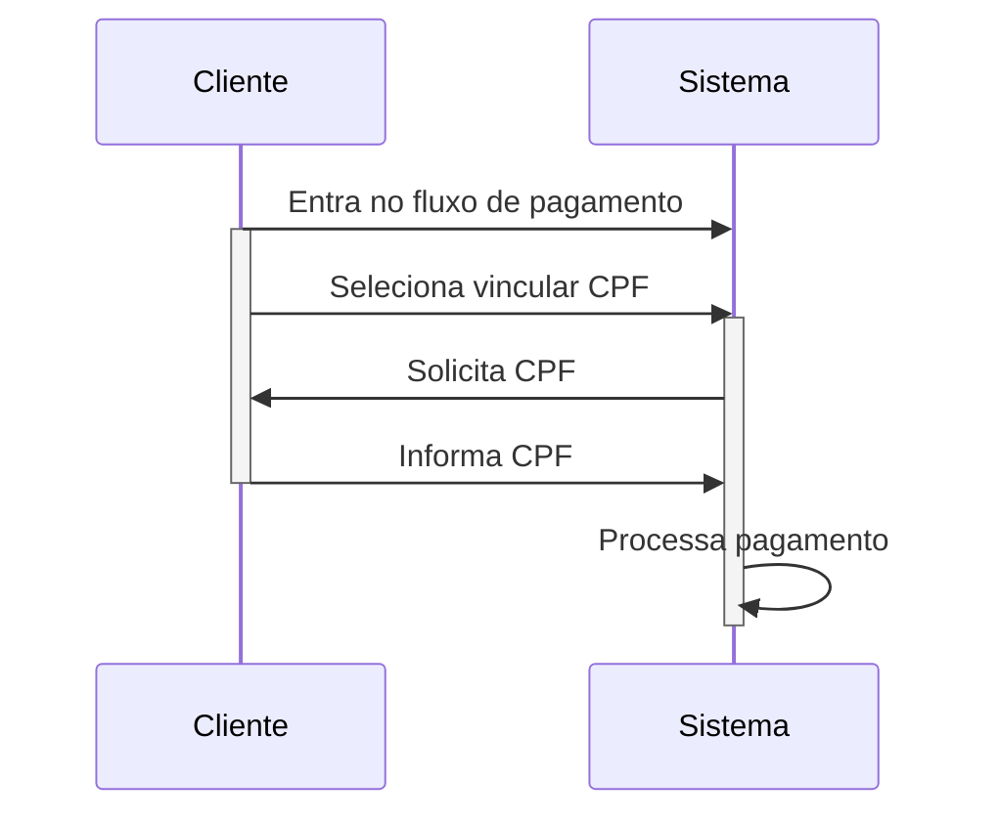
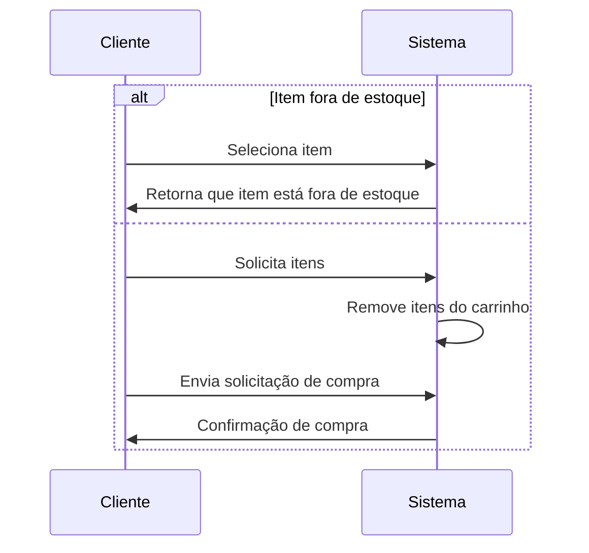
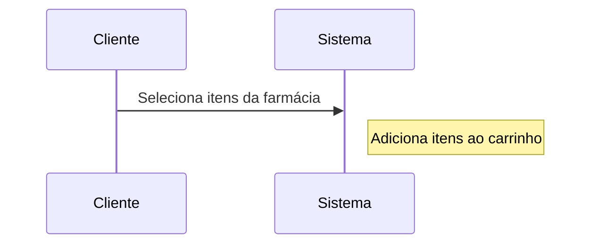

# Introdução

<!-- Adicionar explicação do que é o documento de arquitetura e sua finalidade -->

# Diagrama de Pacote (Front-End)

Diagramas de pacotes são diagramas estruturais comumente usados para simplificar os diagramas de classe complexos e organizar as classes em pacotes. Um grande benefício desse artefato é a visibilidade de alto nível do sistema a ser desenvolvido. Abaixo o grupo criou o diagrama de pacotes referente a aplicação front-end com estruturação na _Clean Architecture_.

## v1.0

O diagrama indica a estrutura do projeto, sendo divida em features, onde cada feature possui as seguintes camadas: infra, data, domain, presentation. Essa estrutura possui diversas classes abstratas, o que entra em acordo com a pasta de testes onde o criamos mocks a partir dessas classes abstratas. A arquitetura do projeto será a _Clean Architecture_, filosofia para design de software, ela separa os elementos do software em anéis de acesso. 
Isso tem como objetivo organizar o código a fim de encapsular as regras de negócio. A principal regra dessa metodologia de design é que anéis mais externos podem ter conhecimento de anéis internos, porém o inverso não é verdade, dessa forma, camadas internas, não conhecem funções/ métodos de camadas externas.

### Infra

Camada que faz o intermédio com à api do sistema, tem a responsabilidade de fazer a request e receber o dado "cru" sem nenhuma tratativa.

### Data

Camada responsável por tratar o dado adquirido pela infra e passá-lo ao domínio já estruturado como é requisitado. Caso o dado não esteja como esperado, será essa camada que levantará uma exceção que irá ser tratada no domínio da aplicação.

### Domain

Camada encapsulado do sistema frontend que não é afetada por mudanças fora dessa camada (com exceções de mudanças na regra do negócio). Nessa camada que é definida os usecases, entidades e falhas específicas do domínio. No caso de necessidade de vários usecases pode-se criar uma rotina que faz uso de um agrupamento de usecases.

## Diagrama de Sequência

### Introdução

Os diagramas de sequência são uma representação gráfica fundamental para modelar a interação entre objetos em um sistema. Eles fornecem uma visão detalhada da sequência de mensagens trocadas entre os objetos ao longo do tempo, permitindo que se visualize o comportamento dinâmico do sistema em questão. Além disso, os diagramas de sequência são amplamente utilizados na modelagem de processos de negócios, fluxos de trabalho e interações de software[3]. Como resultado, eles são ferramentas valiosas para os desenvolvedores de software e usuários finais, auxiliando na identificação de requisitos funcionais do sistema e na lógica de processamento de dados. Em resumo, os diagramas de sequência são uma parte essencial do processo de engenharia de software, permitindo uma comunicação clara e concisa de ideias e requisitos.

 Figura 1: diagrama de sequência do Projeto Integrador 2, Med Grabber(Fonte: autores, 2023).

### Composição do Diagrama de Sequência

1. **Participante:** Os objetos ou atores envolvidos na interação são representados como participantes no diagrama.[4]

2. **Mensagens:** As mensagens representam a comunicação entre os participantes, indicando as informações trocadas e a ordem em que as mensagens são enviadas.[2]

3. **Linhas de vida:** As linhas de vida representam o tempo durante o qual um participante está ativo no sistema.[4]

4. **Ativação:** A ativação é usada para indicar quando um participante está executando uma tarefa específica em resposta a uma mensagem recebida.[4]

5. **Desvios de condição:** Desvios de condição são usados para indicar fluxos alternativos na sequência de mensagens, dependendo das condições específicas que ocorrem durante a interação.[4]

6. **Anotações:** As anotações são usadas para adicionar informações adicionais ao diagrama, como notas ou explicações sobre a interação.[4]

<!--Bibitex para referencia

@article{LuLunjin2014Rbos,
  title={Required behavior of sequence diagrams: Semantics and conformance},
  author={Lu, Lunjin and Kim, Dae-Kyoo},
  journal={ACM transactions on software engineering and methodology},
  volume={23},
  number={2},
  pages={1--28},
  year={2014}
}

@misc{IBM,
  title={Sequence diagrams},
  author={IBM},
  howpublished={\url{https://www.ibm.com/docs/pt-br/rsm/7.5.0?topic=uml-sequence-diagrams}},
  year={Acesso em: 27 abr. 2023},
}

-->

# Diagrama de Classes

Os diagramas de classes são usados para descrever a estrutura de um sistema orientado a objetos. Ele representa a estrutura estática do sistema em termos de classes, interfaces, atributos, métodos e relacionamentos entre eles.

As classes são representadas como retângulos, com o nome da classe no topo do retângulo. Os atributos são listados abaixo do nome da classe, enquanto os métodos são listados abaixo dos atributos.

## v1.0

O diagrama indica o modelo do projeto. Esse modelo possui diversas classes que represemtam as funções do sistema.

## Classes

Inventário: representa uma quatidade de um tipo de produto e sua devida localização, com uma id e um objeto do tipo Produto e uma localização x e outra y para saber sua localidade exata.

Estoque: representa uma lista de objetos do tipo Inventário.

Produto: representa um Produto do Inventário, com um id, nome, descrição e preço.

Pagamento: representa o pagamento de um cliente, com um id, um valor total, um status (concluído ou não), e uma informação do cliente.

Braço: representa o controlador do braço robótico, com um objeto do tipo Estoque, que controla a lista de itens, uma localização atual e um status (ocupado ou livre). Tem métodos para receber a localização, pegar um Produto e entrega-lo em uma posição.

# <<<<<<< HEAD

# Diagrama de entidade relacional

Um Diagrama de Entidade-Relacionamento (DER) é uma representação gráfica que ilustra as entidades, atributos e relacionamentos entre as entidades de um modelo de dados.O DER permite que os desenvolvedores de banco de dados visualizem e compreendam as relações entre as diferentes entidades em um sistema, e isso pode ajudar a garantir que o modelo de dados seja completo, preciso e fácil de entender.

# v1.0

O diagrama indica a estrutura do banco que será utilizado no projeto, sendo dividido em 3 tabelas (Produto,Inventario,Transações) onde cada uma contem as colunas nescessarias para o controle do estoque e compra de cada produto.

## Entidades

Produto: representa os produtos oferecidos e contém os atributos id (identificador único do produto), nome, categoria, valor, descrição.

Inventario: representa as informações de cada produto e contém os atributos de idInventario (identificador único do produto dentro do inventario), x-Localização (posição no eixo x do produto), y-Localização (posição no eixo y do produto),quantidade, produto.

Transação: representa as informações de transações feitas e contém os atributos id(identificador único do produto), total, data, cpf, produtos (lista com todos os produtos da compra), status.

# Modelo Relacional

O modelo relacional é uma representação do banco de dados utilizando tabelas, colunas e chaves primárias e estrangeiras, que permitem armazenar e relacionar informações de forma organizada e eficiente.

# v1.0

# Tabelas

## Produto

- idProduto (chave primária)
- nome
- valor
- categoria
- descrição

# Inventário

- idInventario (chave primária)
- idProduto (chave estranjeira)
- xLocalização
- yLocalização
- quantidade

# Transações

- idTransação (chave primária)
- total
- data
- cpf
- status

# Itens_da_compra

- idItens (chave primária)
- idTransação (chave estranjeira)
- idProduto (chave estranjeira)

Cada tabela possui uma chave primária para identificar cada registro de forma única.

Chaves Estrangeiras:

As chaves estrangeiras são utilizadas para relacionar informações entre as tabelas. As chaves estrangeiras são definidas em uma tabela e referenciam a chave primária de outra tabela.

# Referências

- [1] - Clean architecture in flutter part 1. Disponível em: <https://devmuaz.medium.com/flutter-clean-architecture-series-part-1-d2d4c2e75c47>. Acesso em 23 de Abril de 2023.
- [2] - Designing Software Using Clean Architecture: Domain-Driven Design. Disponível em: <https://betterprogramming.pub/how-to-design-in-clean-architecture-way-part-2-8524e76f2720>. Acesso em 23 de Abril de 2023.
- [3] LU, L.; KIM, D.-K. Required behavior of sequence diagrams: Semantics and conformance. ACM Transactions on Software Engineering and Methodology, v. 23, n. 2, p. 1-28, 2014.
- [4] IBM. IBM Rational Software Modeler. Sequence diagrams. Disponível em: https://www.ibm.com/docs/pt-br/rsm/7.5.0?topic=uml-sequence-diagrams. Acesso em: 27 abr. 2023.
- [5] - Pilone, D., & Pitman, N. (2005). UML 2.0 in a Nutshell. O'Reilly Media.
- [6] - Booch, G., Rumbaugh, J., & Jacobson, I. (1999). UML - Guia do Usuário. Bookman.
- [7] - Pilone, D., & Pitman, N. (2005). UML 2.0 in a Nutshell. O'Reilly Media.
- [8] - Booch, G., Rumbaugh, J., & Jacobson, I. (1999). UML - Guia do Usuário. Bookman.
- [9] - TEORY, T. LIGHTSTONE, S., NADEAU, T. and JAGADISH, H. V. Database Modeling and Design: Logical Design. USA: Morgan Kaufmann, 2005
- [10] - SILBERSCHATZ, A., KORTH, H. F. e SUDARSHAN, S. Sistemas de Bancos de Dados. Editora Campus. 2006.

## Versionamento

| Versão | Data       | Descrição                                 | Autor(es)        |
| ------ | ---------- | ----------------------------------------- | ---------------- |
| 1.0    | 23/04/2023 | Criação do documento                      | Mauricio Machado |
| 1.1    | 23/04/2023 | Adição do diagrama de pacotes             | Mauricio Machado |
| 1.2    | 27/04/2023 | Adição do diagrama de classes             | Samuel Macedo    |
| 1.3    | 27/04/2023 | Adição do diagrama de entidade relacional | Pedro Moraes     |
| 1.4    | 27/04/2023 | Adição do modelo relacional               | Pedro Moraes     |
| 1.5    | 28/04/2023 | Adição do diagrama de sequência           | Natanael Filho   |
| 1.6    | 28/04/2023 | Correção e Revisaão do Documento Geral    | Davi Mateus      |
