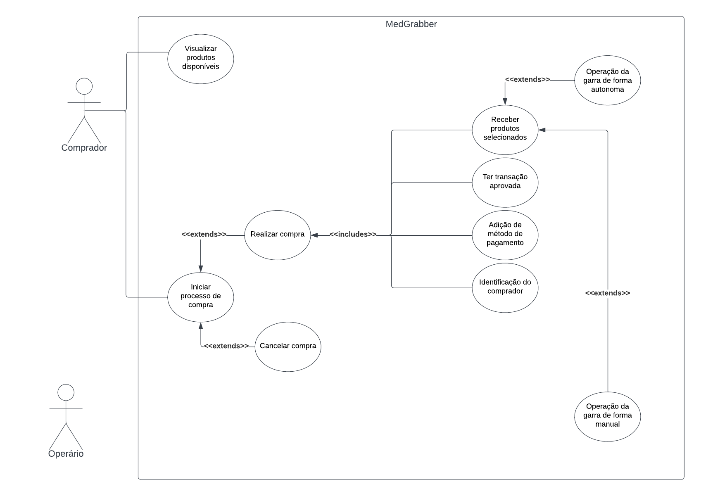

# Introdução

<!-- Adicionar explicação do que é o documento de arquitetura e sua finalidade -->

# Diagrama de Casos de Uso

O diagrama de casos de uso [2] descreve um conjunto de ações, chamados de casos de uso, que um sistema desempenha, levando em consideração os usuários externos ao sistema. Ele pode ser usado para descrever as principais funcionalidades do sistema e a interação com os usuários.  

Para a criação desse artefato foi utilizado a abordagem tradicional, ou seja, representação os casos de uso através de uma diagrama UML[1]. A ferramenta utilizada para a criação do diagrama foi o LucidChart [3], um software online para criação de diagramas.

## v1.0

A seguir, a especificação dos casos de uso identificados.

### UC01. Visualizar produtos disponíveis

| UC01 | Visualizar produtos disponíveis |
| -: | :- |
| **Atores** | <li> Comprador |
| **Frequência de uso** | Alta |
| **Requisitos** | Visualização do estoque atualizado (mesmo sem internet) |
| **Condição de entrada** | O usuário interage com a tela do sistema. Ao interagir, a tela sairá do modo *sono* e irá apresentar a lista de itens disponíveis. |
| **Fluxo principal** | <ol> <li> Sistema sai do modo *sono* <li> Sistema carrega itens em estoque da farmácia </ol>|
| **Fluxos alternativos** | Não há |
| **Fluxos de exceção** | **Fluxo 1. O sistema não reconhece o toque do usuário** <ol> <li> O sistema toca na tela *touch screen* <li> Toque não é reconhecido <li> O usuário alerta o funcionário que reinicia e limpa a tela <li> Usuário toca novamente na tela e seu toque é reconhecido</ol> |

 Tabela 1: Especificação do caso de uso: Visualizar produtos disponíveis. (Fonte: autores, 2022).

### UC02. Buscar produto por nome

| UC02 | Buscar produto por nome |
| -: | :- |
| **Atores** | <li> Comprador |
| **Frequência de uso** | Média |
| **Requisitos** | Carregamento correto do estoque |
| **Condição de entrada** | Lista de produtos disponíveis é carregada. |
| **Fluxo principal** | <ol> <li> Usuário clica na barra de pesquisa e escreve nome do produto que procura. <li> Produto encontrado será mostrado junto com suas informações. </ol>|
| **Fluxos alternativos** | **Fluxo 1. Produto não disponível** <ol> <li> Usuário escreve o nome do produto e clica em ok. </li> <li> Item não é encontrado no estoque.</li> <li> Usuário é apresentado uma tela com a mensagem: *esse item não está disponível. Por favor, volte para a tela de produtos disponíveis*. Ao final da tela terá um botão para voltar a tela de produtos disponíveis. </li> </ol> |
| **Fluxos de exceção** | **Fluxo 1. Erro ao pesquisar produto** <ol> <li> Usuário escreve nome do produto e clica em ok.<li> Processo de filtro por nome falha. <li> Usuário é apresentado uma tela indicando que não conseguimos finalizar a busca, dando a opção de tentar realizar a busca novamente ou voltar a listagem de produtos </ol> |

 Tabela 2: Especificação do caso de uso: Buscar produto por nome. (Fonte: autores, 2022).

### UC03. Iniciar processo de compra

| UC03 | Iniciar processo de compra |
| -: | :- |
| **Atores** | <li> Comprador |
| **Frequência de uso** | Alta |
| **Requisitos** | Carregamento correto do estoque |
| **Condição de entrada** | Usuário adiciona item ao carrinho ou usuário clica em iniciar compra. |
| **Fluxo principal** | <ol> <li> Usuário adiciona item ao carrinho. <li> Usuário fecha o carrinho e segue para realização da compra. </ol>|
| **Fluxos alternativos** | **Fluxo 1. Iniciar fluxo de compra manualmente** <ol> <li> Usuário clica no botão de iniciar fluxo de compra sem adicionar items no carrinho. </li> </ol> |
| **Fluxos de exceção** | Não há |

 Tabela 3: Especificação do caso de uso: Iniciar processo de compra. (Fonte: autores, 2022).

### UC04. Cancelar compra

| UC04 | Cancelar compra |
| -: | :- |
| **Atores** | <li> Comprador |
| **Frequência de uso** | Baixa |
| **Requisitos** | Usuário ter iniciado fluxo de compra |
| **Condição de entrada** | Usuário no fluxo de checkout cancelar a compra ou limpar o carrinho. |
| **Fluxo principal** | <ol> <li> Usuário clica em cancelar compra. <li> Tela entra em modo hibernar até outro clique começar novo processo de compra. </ol>|
| **Fluxos alternativos** | **Fluxo 1. Usuário limpa o carrinho até nenhum item estar no carrinho** <ol> <li> Usuário remove produto adicionado do carrinho. </li> <li> Carrinho fica vazio. </li> <li> Usuário é apresentado uma tela informando que o carrinho está vazio e ele deve adicionar um item antes de seguir com o checkout. </li> </ol> |
| **Fluxos de exceção** | **Fluxo 1. Usuário tenta remover item quando não existem mais itens no carrinho.** <ol> <li> Usuário clica em remover item do carrinho quando carrinho estiver vazio. </li> <li> Usuário é apresentado uma mensagem indicando que o carrinho está sem itens e não tem como remover outro produto/item. </li> </ol> |

 Tabela 4: Especificação do caso de uso: Cancelar compra. (Fonte: autores, 2022).

### UC05. Adicionar item

| UC05 | Adicionar item |
| -: | :- |
| **Atores** | <li> Comprador |
| **Frequência de uso** | Alta |
| **Requisitos** | Usuário ter iniciado fluxo de compra |
| **Condição de entrada** | Usuário clicar no botão de adicionar produto ao carrinho |
| **Fluxo principal** | <ol> <li> Usuário encontra produto que deseja comprar. <li> Usuário clica no ícone de adicionar desse item. </ol>|
| **Fluxos alternativos** | Não há |
| **Fluxos de exceção** | **Fluxo 1. Produto não está disponível.** <ol> <li> Usuário encontra produto que deseja comprar. <li> Usuário clica no ícone de adicionar desse item. <li> Produto não está mais disponível no estoque. <li> Usuário é apresentado com uma tela informando que o produto dele não está mais disponível e os possíveis motivos disso ter acontecido. </ol> |

 Tabela 5: Especificação do caso de uso: Adicionar item. (Fonte: autores, 2022).

### UC06. Remover item

| UC06 | Remover item |
| -: | :- |
| **Atores** | <li> Comprador |
| **Frequência de uso** | Alta |
| **Requisitos** | Usuário ter iniciado fluxo de compra |
| **Condição de entrada** | Usuário clicar no botão de remover produto do carrinho |
| **Fluxo principal** | <ol> <li> Usuário acessa carrinho de compras. <li> Usuário clica no botão de remover item do carrinho. </ol>|
| **Fluxos alternativos** | Não há |
| **Fluxos de exceção** | **Fluxo 1. Remover item com carrinho vazio.** <ol> <li> Usuário clica em remover item do carrinho quando carrinho estiver vazio. </li> <li> Usuário é apresentado uma mensagem indicando que o carrinho está sem itens e não tem como remover outro produto/item. </li> </ol> |

 Tabela 6: Especificação do caso de uso: Remover item. (Fonte: autores, 2022).

### UC07. Identificação do comprador

| UC07 | Identificação do comprador |
| -: | :- |
| **Atores** | <li> Comprador |
| **Frequência de uso** | Alta |
| **Requisitos** | Usuário iniciar o fluxo de checkout. |
| **Condição de entrada** | Usuário clicar em continuar na aba de carrinho. |
| **Fluxo principal** | <ol> <li> Usuário acessa carrinho de compras. <li> Usuário clica no botão de continuar. <li> Usuário preenche campo de número de cadastro de pessoa física. <li> Número é validado e pode seguir o fluxo de compra </ol>|
| **Fluxos alternativos** | Não há |
| **Fluxos de exceção** | **Fluxo 1. Documento inválido.** <ol> <li> Usuário adiciona número de CPF inválido. </li> <li> Usuário é apresentado uma mensagem indicando que o documento apresentado está errado. O sistema irá apresentar possíveis ocorrências desse erro. </li> </ol> |

 Tabela 7: Especificação do caso de uso: Identificação do comprador. (Fonte: autores, 2022).

### UC08. Operação da garra de forma manual

| UC08 | Operação da garra de forma manual |
| -: | :- |
| **Atores** | <li> Operário |
| **Frequência de uso** | Baixa |
| **Requisitos** | Operário ter credencial com autorização de sobrescrever método de operação da garra. |
| **Condição de entrada** | Inserir credencial no sistema. |
| **Fluxo principal** | <ol> <li> Operário acessa o totem. <li> Operário clica no botão de admin. <li> Adiciona credencial de acesso. <li> Opera a máquina. <li> Após período de 1 minuto sem atividade sistema irá voltar ao modo *sono* e sair do modo de operação manual fazendo braço voltar a posição inicial </ol>|
| **Fluxos alternativos** | Não há |
| **Fluxos de exceção** | **Fluxo 1. Credencial inválida ou sem permissão.** <ol> <li> Usuário adiciona credencial inválido ou sem acesso. </li> <li> Usuário é apresentado uma mensagem indicando que não foi possível entrar no modo manual. Não serão adicionadas informações adicionais sobre erros nessa tela, a fim de evitar acessos indesejados. </li> </ol> |

 Tabela 8: Especificação do caso de uso: Operação da garra de forma manual. (Fonte: autores, 2022).

##  Introdução

A introspecção é uma técnica essencialmente voltada para especialistas em requisitos, que devem extrair as melhores informações por meio de uma análise profunda sobre como e quais requisitos são necessários para satisfazer os usuários e stakeholders do sistema. Embora seja uma técnica rica em detalhes e informações, pode não ser adequada quando não é um especialista da área realizando-a. No entanto, mesmo que não seja um especialista, ainda pode ser útil realizar a técnica de introspecção para extrair o máximo de suas vantagens e obter informações valiosas para o projeto. 

A técnica utilizada consiste em o engenheiro de requisitos utilizar a imaginação como principal ferramenta, colocando-se no lugar do usuário do sistema e imaginando o que ele gostaria de realizar ao desempenhar determinadas atividades no sistema. Dessa forma, é possível obter informações valiosas sobre as necessidades e desejos dos usuários, contribuindo para a elaboração de requisitos mais precisos e efetivos para o projeto.

## Metodologia

 A fim de elaborar o artefato de requisitos, cada membro do grupo utilizou individualmente a técnica da introspecção para elicitar requisitos, os quais foram posteriormente compilados em um único artefato, eliminando duplicações de requisitos. Dessa forma, foi possível obter uma visão geral dos requisitos desejados pelos stakeholders do projeto, evitando redundâncias e garantindo a precisão das informações coletadas

## 4. Requisitos levantados

 
    A partir dos dados obtidos pelo brainstorming foi possível levantar possíveis requisitos da aplicação.

 
    Dessa forma, foram detectados os seguintes requisitos:

## 4. Requisitos levantados
|ID|Descrição|Tipo de Requisito
|--|--|--|
|I01|Cadastro e login de <a href="../../modelagem/lexicos#usuario">usuário</a> com opção de recuperar senha|RF|
|I02|O <a href="../../modelagem/lexicos#produtor">produtor</a> deve visualizar suas <a href="../../modelagem/lexicos#propriedade">propriedades</a>|RF|
|I03|O sistema deverá  deve <a href="../../modelagem/lexicos#cadastrar_plantio">cadastrar uma plantação</a>|RF|
|I04|O produtor pode visualizar o histórico de suas <a href="../../modelagem/lexicos#visualizar_plantio">plantações</a> e <a href="../../modelagem/lexicos#visualizar_aplicacao_agrotoxico">agrotóxicos</a>|RF|
|I05|O produtor pode visualizar o perfil do <a href="../../modelagem/lexicos#tecnico">técnico</a> que está monitorando sua propriedade|RF|
|I06|O produtor pode visualizar o <a href="../../modelagem/lexicos#plantio_plantado">status de cada plantação</a>|RF|
|I07|O produtor deve <a href="../../modelagem/lexicos#aplicar_agrotoxico">cadastrar o uso do agrotóxico</a> com foto e data apenas|RF|
|I08|O técnico deve ter <a href="../../modelagem/lexicos#analisar_aplicacao_agrotoxico">acesso a foto dos agrotóxicos</a> enviadas pelos produtores|RF|
|I09|O técnico deve <a href="../../modelagem/lexicos#visualizar_propriedade">visualizar as propriedades</a> supervisionadas por ele|RF|
|I10|O aplicativo deve ter uso simples|RNF|
|I11|O usuário deve <a href="../../modelagem/lexicos#visualizar_plantio">visualizar as informações das plantações</a> responsáveis|RF|
|I12|O produtor pode ter acesso a recomendações e boas práticas para o produto agrícola plantado|RF|
|I13|O produtor deve adicionar a data de colheita <a href="../../modelagem/lexicos#plantio_finalizado">encerrando a plantação</a>|RF|
|I14|O produtor pode programar o uso de um agrotóxico |RF|
|I15|O técnico deve  editar as informações necessárias da plantação e do agrotóxico |RF|
|I16|O usuário pode editar suas informações pessoais|RF|
|I17|O usuário deve ter acesso a informações pertinentes ao uso do app (<a href="../../modelagem/lexicos#plantio_finalizado">plantações concluídas</a>, <a href="../../modelagem/lexicos#aplicacao_agrotoxico">agrotóxicos utilizados</a>)|RF|
|I18|O aplicativo deve ser seguro para garantir o <a href="../../modelagem/lexicos#cardeneta_de_campo">rastreamento das plantações</a>|RNF| 
|I19|O aplicativo deve ser intuitivo|RNF|
|I20|O aplicativo deve ser acessível|RNF|
<h6 align = "center">Tabela 1: Tabela contendo os requisitos levantados pela introspecção</h6>
<h6 align = "center">Fonte: Autor</h6>

|Legenda|Descrição|
|:--:|:--:|
|I|Introspecção|
|RF|Requisito Funcional|
|RNF|Requisito Não Funcional|
<h6>Tabela 2: Legenda dos acrônimos contidos na Tabela 1</h6>
<h6>Fonte: Autor</h6>

# Referências

[1] DevMedia. O que é UML e Diagramas de Caso de Uso: Introdução Prática à UML. 2012. DevMedia. Disponível em: <https://www.devmedia.com.br/o-que-e-uml-e-diagramas-de-caso-de-uso-introducao-pratica-a-uml/23408>. Acessado em 07 de dez. de 2022.

[2] IBM. Diagramas de Caso de Uso. IBM. Disponível em: <https://www.ibm.com/docs/pt-br/rsm/7.5.0?topic=diagrams-use-case>. Acessado em 07 de dez. de 2022

[3] Ferramenta Lucidchart, disponível no [link](https://www.lucidchart.com/pages/pt). Acessado em 07 de dez. de 2022.

[4] DevMedia. Especificação de Casos de Uso na Prática. 2010. DevMedia. Disponível em no [link](https://www.devmedia.com.br/especificacao-de-casos-de-uso-na-pratica/18427). Acessado em 09 de dez. de 2022.

[5] - SERRANO, Maurício; SERRANO, Milene. Disponível em: Requisitos - Aula 07. 1º/2019. 50 slides. Material apresentado para a disciplina de Requisitos de Software no curso de Engenharia de Software da UnB, FGA.

[6] - ANDRADE DE MORAIS, E. Utilização de uma estratégia para Identificação de fontes de informação na fase de Elicitação. Doutorado—[s.l.] Pontifícia Universidade Católica Do Rio De Janeiro, 2021.