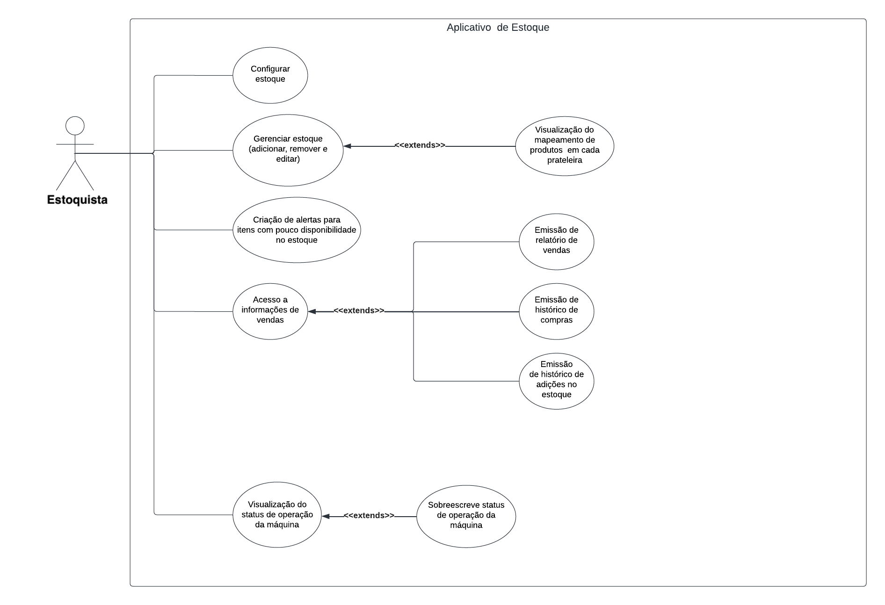

# Documento de Requisito

<!-- Adicionar explicação do que é o documento de requisito e sua finalidade -->

# Diagrama de Casos de Uso

O diagrama de casos de uso [2] descreve um conjunto de ações, chamados de casos de uso, que um sistema desempenha, levando em consideração os usuários externos ao sistema. Ele pode ser usado para descrever as principais funcionalidades do sistema e a interação com os usuários.  

Para a criação desse artefato foi utilizado a abordagem tradicional, ou seja, representação os casos de uso através de uma diagrama UML[1]. A ferramenta utilizada para a criação do diagrama foi o LucidChart [3], um software online para criação de diagramas.

## v2.0

## v1.0

[Diagrama de Casos de Uso v1.0](./assets/documento_requisito/diagrama_caso_de_uso_v1.png)

A seguir, a especificação dos casos de uso identificados.

<!-- TODO: Listar os casos de uso em tabelas -->

<!-- ### UC01. Visualizar produtos disponíveis

| UC01 | Visualizar produtos disponíveis |
| ----------------------: | |:---------------------------------------------------------------------------------------------------------------------------------------------------------------------------------------------------------------------------------------------------------------------- |
| **Atores** | <li> Comprador |
| **Frequência de uso** | Alta |
| **Requisitos** | Visualização do estoque atualizado (mesmo sem internet) |
| **Condição de entrada** | O usuário interage com a tela do sistema. Ao interagir, a tela sairá do modo _sono_ e irá apresentar a lista de itens disponíveis. |
| **Fluxo principal** | <ol> <li> Sistema sai do modo _sono_ <li> Sistema carrega itens em estoque da farmácia </ol> |
| **Fluxos alternativos** | Não há |
| **Fluxos de exceção** | **Fluxo 1. O sistema não reconhece o toque do usuário** <ol> <li> O sistema toca na tela _touch screen_ <li> Toque não é reconhecido <li> O usuário alerta o funcionário que reinicia e limpa a tela <li> Usuário toca novamente na tela e seu toque é reconhecido</ol> |

 Tabela 1: Especificação do caso de uso: Visualizar produtos disponíveis. (Fonte: autores, 2022).

 -->

# Brainstorm

O brainstorm é uma técnica utilizada para levantar requisitos e aprender sobre novas características que os usuários apreciariam em um produto. Essa técnica tem como objetivo incentivar a criatividade do usuário a partir da filosofia de que cada um é livre para opinar e apresentar suas ideias acerca do que deve ser melhorado, sem julgamentos nem cobranças. Buscando assim, levantar o máximo de opiniões em torno de um tema.

| Membros Participantes |
| :-------------------: |
|   Mauricio Machado    |

O identificador de cada requisito é formado por 'B' mais uma letra entre 'C' ou 'E' para indicar consumidor ou estoque, e mais um número, sendo 'B' uma abreviação de Brainstorm, e o tipo de requisito refere-se à classificação entre requisitos funcionais (RF) e não funcionais (RNF).

Como resultado das reuniões e pesquisas, nós obtivemos o temas de requisitos funcionais e não funcionais representados na Tabela 1.

| Identificador | Requisito                                                                                                                                                | Tipo |
| :-----------: | -------------------------------------------------------------------------------------------------------------------------------------------------------- | :--: |
|      BE1      | Usuário deve conseguir visualizar a quantidade dos produtos no estoque.                                                                                  |  RF  |
|      BE2      | Usuário deve conseguir solicitar retirada de produtos do estoque.                                                                                        |  RF  |
|      BE3      | Usuário deve ser capaz de registrar produtos no estoque.                                                                                                 |  RF  |
|      BE4      | Usuário deve ser capaz de editar produtos presentes no estoque.                                                                                          |  RF  |
|      BE5      | Usuário pode emitir um relatório de venda dos produtos.                                                                                                  |  RF  |
|      BE6      | Usuário pode customizar alertas sobre itens cujo o estoque esteja acabando.                                                                              |  RF  |
|      BE7      | Usuário deve ser capaz de registrar o estoque disponível no aplicativo.                                                                                  |  RF  |
|      BE8      | Usuário deve ser capaz de verificar a performance de vendas em períodos de tempo selecionados.                                                           |  RF  |
|      BE9      | Usuário deve ser informado sobre valor total do estoque.                                                                                                 |  RF  |
|     BE10      | Usuário deve ser informado qual seu produto mais performático em um período de tempo selecionado.                                                        |  RF  |
|     BE11      | Usuário deve logar toda adição de itens ao estoque.                                                                                                      |  RF  |
|     BE11      | Usuário pode verificar hisórico de adições no estoque.                                                                                                   |  RF  |
|     BE12      | Usuário pode verificar histórico de vendas.                                                                                                              |  RF  |
|     BE13      | Usuário pode visualizar o mapeamento dos produtos de cada prateleira.                                                                                    |  RF  |
|     BE14      | Usuário deve ter acesso ao status de operação da máquina.                                                                                                |  RF  |
|     BE15      | Usuário pode sobreescrever o status de operação da máquina.                                                                                              |  RF  |
|     BE16      | Sistema deve ter acesso a energia.                                                                                                                       | RNF  |
|     BE17      | Sistema deve ter conexão a internet.                                                                                                                     | RNF  |
|     BE18      | Sistema deve apresentar produtos populares.                                                                                                              | RNF  |
|     BE19      | Sistema deve dar feedback de interação em até 5 segundos.                                                                                                | RNF  |
|     BE20      | Sistema deve proteger as informações do usuário e as transações contra acessos não autorizados.                                                          | RNF  |
|     BE21      | Sistema deve registrar as vendas e atualizar o estoque automaticamente após cada transação.                                                              | RNF  |
|     BE23      | Sistema deve assegurar conformidade de dados com LGPD.                                                                                                   | RNF  |
|     BE24      | Aplicativo deve estar disponível em Android.                                                                                                             | RNF  |
|     BE25      | Sistema deve cessar operação quando uma pessoa estiver presente no mesmo recinto que a máquina.                                                          | RNF  |
|     BE26      | Sistema deve enfileirar pedidos em caso de indisponibilidade de pontos de entrega.                                                                       | RNF  |
|      BP1      | Usuário pode filtrar a lista de produtos.                                                                                                                |  RF  |
|      BP2      | Usuário deve poder visualizar a lista de todos os produtos.                                                                                              |  RF  |
|      BP3      | Usuário pode fazer o pagamento com cartão digital (débito).                                                                                              |  RF  |
|      BP4      | Usuário pode fazer o pagamento com cartão digital (crédito).                                                                                             |  RF  |
|      BP5      | Usuário pode fazer o pagamento via PIX.                                                                                                                  |  RF  |
|      BP6      | Usuário deve realizar cadastro.                                                                                                                          |  RF  |
|      BP7      | Usuário pode adicionar produtos ao carrinho.                                                                                                             |  RF  |
|      BP8      | Usuário deve validar identidade.                                                                                                                         |  RF  |
|      BP9      | Usuário deve validar identidade.                                                                                                                         |  RF  |
|     BP10      | Usuário pode pesquisar um produto.                                                                                                                       |  RF  |
|     BP11      | Usuário pode verificar o status do pedido.                                                                                                               |  RF  |
|     BP12      | Usuário pode iniciar um chat em tempo real.                                                                                                              |  RF  |
|     BP13      | Usuário pode acessar área FAQ e chat.                                                                                                                    |  RF  |
|     BP14      | Usuário deve ter acesso ao valor total da sua compra.                                                                                                    |  RF  |
|     BP15      | Usuário pode fazer compras em grupo.                                                                                                                     |  RF  |
|     BP16      | Usuário recebe notificações.                                                                                                                             |  RF  |
|     BP17      | Usuário pode fazer informações do produto serem lidas para ele.                                                                                          |  RF  |
|     BP18      | Sistema deve proteger as informações do usuário e as transações contra acessos não autorizados.                                                          | RNF  |
|     BP19      | Sistema deve ter conexão a internet.                                                                                                                     | RNF  |
|     BP20      | Sistema deve ter contraste adequado entre a fonte de texto e a cor de fundo de modo que usuários com distúrbios de visão possam ler as informações.      | RNF  |
|     BP21      | Sistema deve guardar informações em conformidade com a LGPD.                                                                                             | RNF  |
|     BP22      | Sistema deve ser disponível para plataformas Mobile Android.                                                                                             | RNF  |
|     BP23      | Em sua primeira compra, 65% dos usuários devem ser capazes de efetivar sem precisar de entrar em contato com o suporte.                                  | RNF  |
|     BP24      | Sistema  deve reembolsar o usuário que cancelar a compra sem justificativa em até 5 minutos.                                                             | RNF  |
|     BP25      | Sistema deve ser capaz de identificar se cpf é válido.                                                                                                   | RNF  |
|     BP26      | Sistema deve validar identidade facial do usuário e sua relação com o cpf cadastrado.                                                                    | RNF  |
|     BP27      | Sistema deve ser desenvolvido de forma responsiva, adaptando a aparência e funcionalidade do sistema às diferentes telas e tamanhos de dispositivos.     | RNF  |
|     BP28      | O aplicativo deve ser intuitivo, sendo consistente em toda a interface de usuário, garantindo que o usuário possa prever o que acontecerá em cada etapa. | RNF  |
|     BP29      | Sistema deve dar feedback de interação em até 5 segundos.                                                                                                | RNF  |

## Requisitos Elicitados

# Introspecção

## Introdução

A introspecção é uma técnica essencialmente voltada para especialistas em requisitos, que devem extrair as melhores informações por meio de uma análise profunda sobre como e quais requisitos são necessários para satisfazer os usuários e stakeholders do sistema. Embora seja uma técnica rica em detalhes e informações, pode não ser adequada quando não é um especialista da área realizando-a. No entanto, mesmo que não seja um especialista, ainda pode ser útil realizar a técnica de introspecção para extrair o máximo de suas vantagens e obter informações valiosas para o projeto. 

A técnica utilizada consiste em o engenheiro de requisitos utilizar a imaginação como principal ferramenta, colocando-se no lugar do usuário do sistema e imaginando o que ele gostaria de realizar ao desempenhar determinadas atividades no sistema. Dessa forma, é possível obter informações valiosas sobre as necessidades e desejos dos usuários, contribuindo para a elaboração de requisitos mais precisos e efetivos para o projeto.

## Metodologia

 A fim de elaborar o artefato de requisitos, cada membro do grupo utilizou individualmente a técnica da introspecção para elicitar requisitos, os quais foram posteriormente compilados em um único artefato, eliminando duplicações de requisitos. Dessa forma, foi possível obter uma visão geral dos requisitos desejados pelos stakeholders do projeto, evitando redundâncias e garantindo a precisão das informações coletadas

## Requisitos levantados

 
    A partir dos dados obtidos pelo brainstorming foi possível levantar possíveis requisitos da aplicação.

 
    Dessa forma, foram detectados os seguintes requisitos:

| ID  | Descrição                                                                                                                                                                                                                       | Tipo de Requisito |
| --- | ------------------------------------------------------------------------------------------------------------------------------------------------------------------------------------------------------------------------------- | ----------------- |
| I01 | O sistema deverá identificar a localização inicial do serviço                                                                                                                                                                   | RF                |
| I02 | O sistema deverá indicar quais produtos estão fora do inventário </a>                                                                                                                                                           | RF                |
| I03 | O sistema deve ser capaz de integrar-se a outros sistemas ou plataformas, como mídias sociais, serviços de pagamento ou serviços de entrega. O sistema deve fornecer documentação técnica ou APIs para facilitar a integração.> | RF                |
| I04 | O usuário poderá acompanhar o status do andamento do serviço                                                                                                                                                                    | RF                |
| I05 | O sistema deve permitir que os usuários comparem produtos ou serviços com base em critérios específicos, como preço, qualidade ou recursos                                                                                      | RF                |
| I06 | O sistema deve permitir que os usuários vejam o histórico de pedidos e o status atual de cada pedido                                                                                                                            | RF                |
| I07 | O sistema deve permitir que os usuários concluam uma compra, inserindo informações de pagamento e endereço de entrega                                                                                                           | RF                |
| I08 | O sistema deve ser flexível o suficiente para acomodar mudanças futuras, incluindo a adição ou remoção de recursos, funcionalidades e requisitos                                                                                | RF                |
| I9  | O sistema deverá preservar energia e reiniciar automaticamente quando não estiver em uso                                                                                                                                        | RNF               |
| I10 | O sistema deve ser responsivo                                                                                                                                                                                                   | RNF               |
| I11 | O aplicativo deve ser intuitivo                                                                                                                                                                                                 | RNF               |
| I12 | O aplicativo deve ser acessível                                                                                                                                                                                                 | RNF               |

<h6 align = "center">Tabela 1: Tabela contendo os requisitos levantados pela introspecção</h6>
<h6 align = "center">Fonte: Autor</h6>

| Legenda |        Descrição        |
| :-----: | :---------------------: |
|    I    |      Introspecção       |
|   RF    |   Requisito Funcional   |
|   RNF   | Requisito Não Funcional |

<h6>Tabela 2: Legenda dos acrônimos contidos na Tabela 1</h6>
<h6>Fonte: Autor</h6>

# Referências

[1] DevMedia. O que é UML e Diagramas de Caso de Uso: Introdução Prática à UML. 2012. DevMedia. Disponível em: <https://www.devmedia.com.br/o-que-e-uml-e-diagramas-de-caso-de-uso-introducao-pratica-a-uml/23408>. Acessado em 07 de dez. de 2022.

[2] IBM. Diagramas de Caso de Uso. IBM. Disponível em: <https://www.ibm.com/docs/pt-br/rsm/7.5.0?topic=diagrams-use-case>. Acessado em 07 de dez. de 2022

[3] Ferramenta Lucidchart, disponível no [link](https://www.lucidchart.com/pages/pt). Acessado em 07 de dez. de 2022.

[4] DevMedia. Especificação de Casos de Uso na Prática. 2010. DevMedia. Disponível em no [link](https://www.devmedia.com.br/especificacao-de-casos-de-uso-na-pratica/18427). Acessado em 09 de dez. de 2022.

[5] - SERRANO, Maurício; SERRANO, Milene. Disponível em: Requisitos - Aula 07. 1º/2019. 50 slides. Material apresentado para a disciplina de Requisitos de Software no curso de Engenharia de Software da UnB, FGA.

[6] - ANDRADE DE MORAIS, E. Utilização de uma estratégia para Identificação de fontes de informação na fase de Elicitação. Doutorado—[s.l.] Pontifícia Universidade Católica Do Rio De Janeiro, 2021.

## Histórico de Versão 

| Versão | Data       | Descrição                                           | Autor(es)                                                |
| ------ | ---------- | --------------------------------------------------- | -------------------------------------------------------- |
| 1.0    | 23/04/2023 | Criação do documento                                | Mauricio Machado                                         |
| 1.1    | 23/04/2023 | Adição do diagrama de casos de uso e sua explicação | Mauricio Machado                                         |
| 1.2    | 26/04/2023 | Adição dos requisitos via brainstorm                | Mauricio Machado, Davi Matheus, Filipe Machado, Natanael |
| 1.3    | 27/04/2023 | Adição dos requisitos via introspecção              | Davi Matheus                                             |
| 1.4    | 12/05/2023 | Refatoração requisitos de brainstorm                | Mauricio Machado, Davi Matheus, Natanael, Pedro Henrique |
