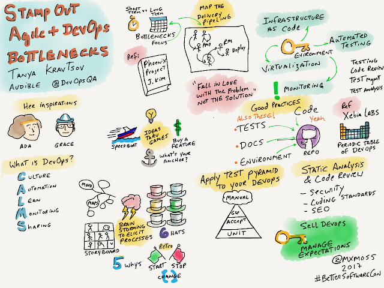
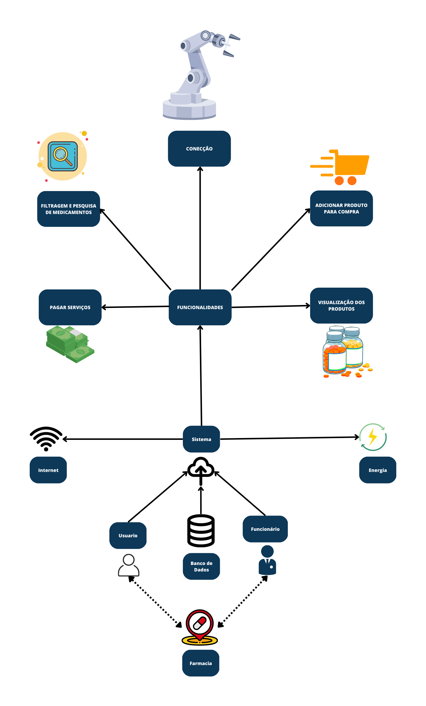

# Introdução

<!-- Adicionar explicação do que é o documento de visão e sua finalidade -->

# 
 Rich Pictures

## Histórico de Versão 
|    Data    | Versão | Descrição            | Autor(es)       |
| :- | :- | :- | :- |
| 25.04.2022 |  1.0   | Criação do documento | [Davi matheus](https://github.com/DaviMatheus) |
| 28.04.2022 |  1.1   | Adição do Rich picture v2 | [Samuel Macedo](https://github.com/Samuelcastro7) |
|28.04.2022  | 1.2    | Conclusão do documento de RichPicture | [Davi matheus](https://github.com/DaviMatheus) |

&emsp;&emsp;
<code>Rich pictures</code> é uma técnica de modelagem de ideias informal e ideal para reuniões, pois permite um rápido entendimento sobre problemas complexos ou mal definidos. Através de desenhos rascunhados e textos curtos e objetivos, é possível expressar momentos e desejos de forma colaborativa com os stakeholders. Tanto a mão livre quanto o uso de software podem ser utilizados na construção do <code>rich picture</code>, e por ser um modelo informal, não há consenso sobre sua sintaxe e forma de uso.

&emsp;&emsp;
O objetivo deste documento é apresentar todos os <code>rich pictures</code> criados pelos integrantes do grupo durante o processo de entendimento do projeto de um braço mecânico , no qual é um dispositivo robótico que é capaz de executar tarefas mecânicas e/ou eletrônicas. Ele é projetado para imitar a funcionalidade de um braço humano, permitindo que ele possa ser controlado remotamente ou programado para executar tarefas específicas. O objetivo deste projeto é utilizar essa ferramenta em um contexto de empilhamento e organização de produtos em uma farmácia no contexto de uma compra , a fim de aumentar a eficiência e a precisão do gerenciamento de estoque, facilitando a identificação de produtos e melhorando a experiência do cliente.

    
    <figcaption align='center'>
        <b>
            <a href='./assets/documento_visao/RichPicture.png'>
               Figura 1: Exemplo de rich picture
            </a>
        </b>   
         
        <small>Fonte: http://mxmossman.blogspot.com/2017/10/better-software-2017.html.</small>
    </figcaption>

## Metodologia

&emsp;&emsp;
 Para elaboração do <code>rich picture</code> cada membro do grupo designado para a tarefa confecionará um sobre o projeto e o restantede do grupo após analisar o <code>rich picture</code> poderá ter uma visão mais clara sobre o escopo do projeto em si.

### Versão das Rich-Pictures 

&emsp;&emsp;
Neste tópico, são apresentados os rich-pictures criados pelos integrantes. Na primeira versão, elaborou-se uma visão mais simples e visual, que servirá como base para a elaboração da próxima versão do RichPicture pelos membros.

## Resultados

### Rich-Pictures v1

    
    <figcaption align='center'>
        <b>
            <a href='./assets/documento_visao/RichPicture_Davi.png''>
               Figura 2: Rich Picture V1
            </a>
        </b>   
         
        <small>Autor: <a href='https://github.com/DaviMatheus'>Davi Matheus</a>, 2023.</small>
    </figcaption>

### Rich-Pictures v2

    
    <figcaption align='center'>
        <b>
            <a href='./assets/documento_visao/RichPicture_Samuel.png'>
               Figura 3: Rich Picture V2
            </a>
        </b>   
         
        <small>Autor: <a href='https://github.com/Samuelcastro7'>Samuel Macedo</a>, 2023.</small>
    </figcaption>

## Referências

> [1] - Rational Software Architect RealTime Edition. Disponível em: <https://www.ibm.com/docs/pt-br/rsar/9.5?topic=diagrams-creating-communication>. Acesso em: 17 fev. 2022.   > [2] - Diretriz: Diagrama de Comunicação. Disponível em: <https://www.cin.ufpe.br/~gta/rup-vc/core.base_rup/guidances/guidelines/communication_diagram_FFFEA1B5.html>. Acesso em: 17 fev. 2022.   > [3] - Diagramas de comunicação. Disponível em: <https://www.ibm.com/docs/pt-br/radfws/9.6?topic=SSRTLW_9.6.0/com.ibm.xtools.sequence.doc/topics/ccommndiag.html>. Acesso em: 20 fev. 2022.  

