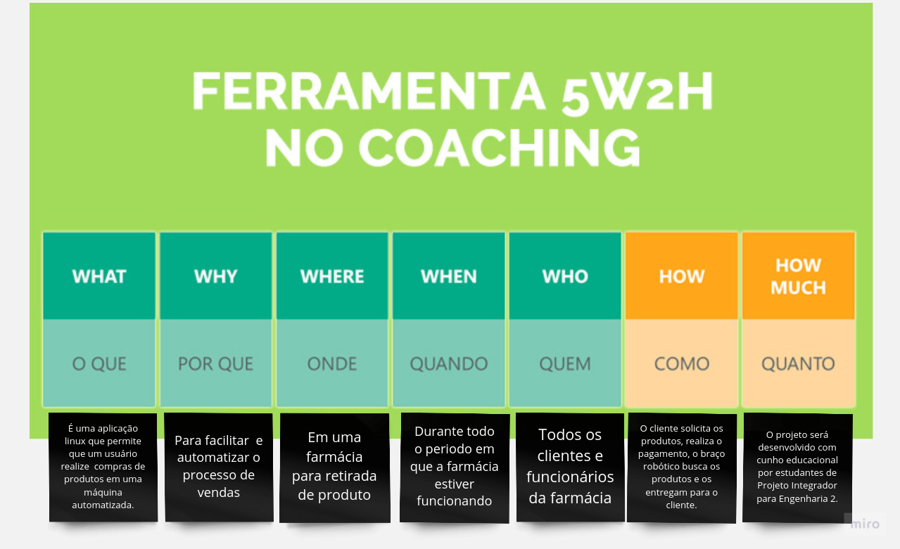
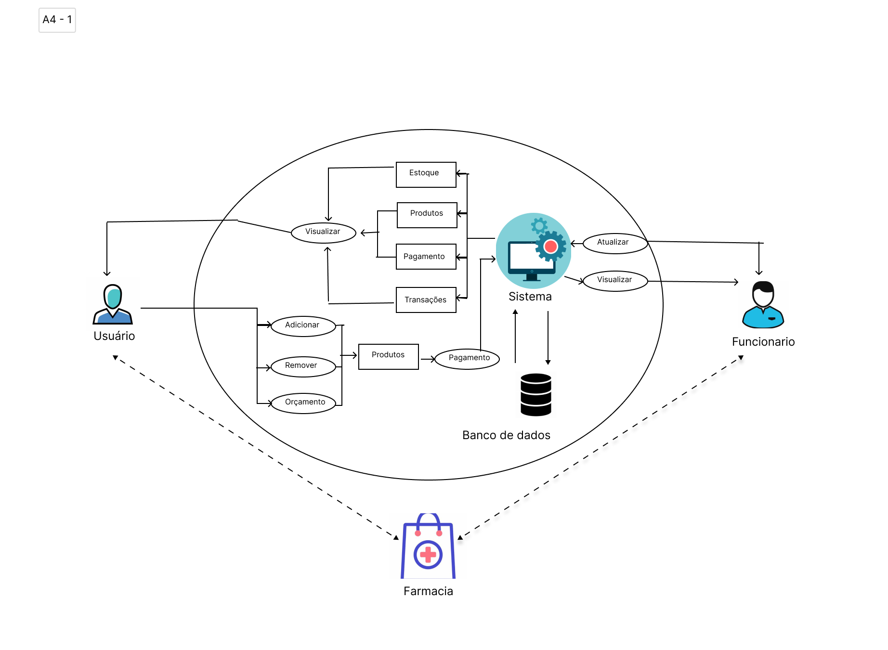

# Documento de Visão

<!-- Adicionar explicação do que é o documento de visão e sua finalidade -->

# 5W2H

<code>5W2H</code> é uma metodologia de gestão que tem como objetivo fornecer uma estrutura clara e objetiva para a definição e execução de projetos e processos. Ela consiste em responder as sete perguntas-chave, divididas em cinco Ws (What, Why, Who, Where, When) e dois Hs (How e How much), que significam espectivamente: O que?, Por quê?, Quem?, Onde?, Quando?, Como? E Quanto custa?. Respondendo a essas perguntas se estará planejando as ações de melhoria ou padronizando processos de forma organizada, garantindo que a execução das atividades aconteça da forma planejada.

O objetivo deste documento é apresentar um entendimento completo do projeto ou processo, alinhando expectativas e metas, evitando problemas de comunicação e, consequentemente, minimizando os riscos de falhas ou erros durante a execução.

 
Figura 1: Exemplo do modelo 5W2H
 

# Modelo 5W2H

## v1.0

# Rich Pictures

&emsp;&emsp;
<code>Rich pictures</code> é uma técnica de modelagem de ideias informal e ideal para reuniões, pois permite um rápido entendimento sobre problemas complexos ou mal definidos. Através de desenhos rascunhados e textos curtos e objetivos, é possível expressar momentos e desejos de forma colaborativa com os stakeholders. Tanto a mão livre quanto o uso de software podem ser utilizados na construção do <code>rich picture</code>, e por ser um modelo informal, não há consenso sobre sua sintaxe e forma de uso.

&emsp;&emsp;
O objetivo deste documento é apresentar todos os <code>rich pictures</code> criados pelos integrantes do grupo durante o processo de entendimento do projeto de um braço mecânico , no qual é um dispositivo robótico que é capaz de executar tarefas mecânicas e/ou eletrônicas. Ele é projetado para imitar a funcionalidade de um braço humano, permitindo que ele possa ser controlado remotamente ou programado para executar tarefas específicas. O objetivo deste projeto é utilizar essa ferramenta em um contexto de empilhamento e organização de produtos em uma farmácia no contexto de uma compra , a fim de aumentar a eficiência e a precisão do gerenciamento de estoque, facilitando a identificação de produtos e melhorando a experiência do cliente.

 Figura 1: Exemplo de rich picture.

<small>Fonte: http://mxmossman.blogspot.com/2017/10/better-software-2017.html.</small>

## Metodologia

&emsp;&emsp;
 Para elaboração do <code>rich picture</code> cada membro do grupo designado para a tarefa confecionará um sobre o projeto e o restantede do grupo após analisar o <code>rich picture</code> poderá ter uma visão mais clara sobre o escopo do projeto em si.

### Versão das Rich-Pictures

&emsp;&emsp;
Neste tópico, são apresentados os rich-pictures criados pelos integrantes. Na primeira versão, elaborou-se uma visão mais simples e visual, que servirá como base para a elaboração da próxima versão do RichPicture pelos membros.

## Resultados

### Rich-Pictures v1

 Figura 2: Rich Picture.

<small>Autor: <a href='https://github.com/DaviMatheus'>Davi Matheus</a>, 2023.</small>

### Rich-Pictures v2

 Figura 3: Rich Picture.

<small>Autor: <a href='https://github.com/Samuelcastro7'>Samuel Macedo</a>, 2023.</small>

# Estudo de Mercado

## Introdução

O objetivo de automatizar o processo de estocagem e venda é aumentar a venda, fazendo que aumente-se o lucro diminuindo o custo com mão de obra.

## Tendências

Uma área em crescente evidência é a Logística 4.0, onde opera sobre as diretrizes da Indústria 4.0.

A Logística 4.0 é uma área que tem a principal função de usar os recursos tecnológicos para otimizar os processos logísticos de uma empresa. Seus pontos positivos são trazer mais velocidade, eficiência e redução de custos para as companhias. Uma área em crescente evidência é a Logística 4.0, onde opera sobre as diretrizes da Indústria 4.0 e visa, não unicamente, a automação de processos de logística e de processos indústriais utilizando robôs. Além disso, a Logística 4.0 busca usar a tecnologia para tornar a operação mais inteligente, integrada, eficiente e transparente.

Nesse contexto, a automação de processos de venda utilizando braços robóticos e um aplicativo para interação com o usuário apresenta múltiplas justificativas. Inicialmente, a eficiência operacional é um dos principais motivos. Os braços robóticos são capazes de realizar tarefas repetitivas com uma precisão e consistência muito maiores do que a mão-de-obra humana, minimizando erros e garantindo qualidade no processo de venda. Isso se traduz em maior produtividade e redução de custos operacionais.

Aumentar a produtividade e a qualidade dos produtos, reduzindo erros humanos e desperdícios;
Reduzir os custos operacionais e de mão de obra, otimizando o uso de recursos e energia;
Melhorar a satisfação e a fidelização dos clientes, oferecendo entregas mais rápidas, precisas e personalizadas;
Acompanhar as tendências e as exigências do mercado, que demanda cada vez mais agilidade, eficiência e inovação.
Portanto, automatizar um processo de venda utilizando braços robóticos e um aplicativo para interação com o usuário é uma forma de implementar a Logística 4.0 na empresa e obter vantagens competitivas no mercado.

## Empresas consolidadas na automação

Existem duas empresas já consolidadas na área de automação que vale a pena mencionar sua atuação no mercado, são elas a Yamaha e a Universal Robots.

Uma visão geral das iniciativas de automação da Yamaha e Universal Robots:

A Yamaha possui uma divisão de robótica, a Yamaha Robotics, que oferece uma variedade de soluções de automação. Seu portfólio inclui braços robóticos, robôs SCARA, robôs cartesianos, controladores e outros dispositivos de automação. Os robôs da Yamaha são conhecidos por sua precisão, velocidade e confiabilidade, sendo utilizados em diversas indústrias, como automotiva, eletrônica, alimentícia, entre outras.

A Universal Robots, por outro lado, é especializada em robôs colaborativos, também conhecidos como cobots. Esses robôs são projetados para trabalhar ao lado de humanos em ambientes industriais. Eles são altamente flexíveis e fáceis de programar, o que permite que sejam utilizados em uma variedade de aplicações, incluindo montagem, embalagem, inspeção de qualidade e muito mais.

Ambas as empresas estão na vanguarda da automação industrial e contribuem significativamente para o avanço da Indústria 4.0, que visa integrar tecnologias digitais e físicas para criar sistemas de produção mais eficientes e flexíveis.

## Análise SWOT

Forças:
- Aumento da demanda por soluções de automação no setor de vendas
- Benefícios significativos proporcionados pela implementação de braços robóticos
- Experiência acumulada em automação e aplicações robóticas em outros segmentos de mercado

Fraquezas:
- Necessidade de adaptar as infraestruturas dos estoques para acomodar a nova tecnologia
- Investimento inicial considerável para a implementação do braço robótico
- Possíveis desafios na integração do braço robótico com sistemas existentes nos estoques

Oportunidades:
- Expansão do mercado brasileiro, proporcionando espaço para inovações
- Exigência de maior eficiência, redução de erros no manuseio de produtos e menor tempo de entrega.

Ameaças:
- Competição com outras soluções tecnológicas no mercado de automação de estoque
- Resistência à mudança por parte de funcionários e clientes
- Possíveis limitações impostas por regulamentações ou legislações específicas sobre robótica

## Referências

- [1] - Rational Software Architect RealTime Edition. Disponível em: <https://www.ibm.com/docs/pt-br/rsar/9.5?topic=diagrams-creating-communication>. Acesso em: 17 fev. 2022.
- [2] - Diretriz: Diagrama de Comunicação. Disponível em: <https://www.cin.ufpe.br/~gta/rup-vc/core.base_rup/guidances/guidelines/communication_diagram_FFFEA1B5.html>. Acesso em: 17 fev. 2022.
- [3] - Diagramas de comunicação. Disponível em: <https://www.ibm.com/docs/pt-br/radfws/9.6?topic=SSRTLW_9.6.0/com.ibm.xtools.sequence.doc/topics/ccommndiag.html>. Acesso em: 20 fev. 2022.
- [4] - PROJECT BUILDER. 5W2H: a metodologia de planejamento que vai ajudar na sua gestão. 2022. Disponível em: https://projectbuilder.com.br/blog/5w2h-a-metodologia-de-planejamento-que-vai-ajudar-na-sua-gestao/. Acesso em: 26 abr. 2023.
- [5] - ROCK CONTENT. O que é 5W2H e como aplicá-lo na sua empresa. 2021. Disponível em: https://rockcontent.com/br/blog/5w2h/. Acesso em: 27 abr. 2023.
- [6] - GESTÃO DE PROJETOS - NA PRÁTICA. Metodologia 5W2H. 2019. Disponível em: https://www.youtube.com/watch?v=Hf8oC_tjJSo. Acesso em: 26 abr. 2023.
- [7] - WWW.TOTVS.COM, Equipe Totvs. O que é logística 4.0 e qual seu impacto?. TOTVS, 2021. Disponível em: https://www.totvs.com/blog/gestao-logistica/logistica-4-0/. Acesso em: 23 maio 2023.
- [8] - WWW.TRACKAGE.COM.BR, Diegodias. Logística 4.0: o que é e quais seus benefícios. Trackage, 2022. Disponível em: https://www.trackage.com.br/blog/logistica-4-0/#:~:text=A%20log%C3%ADstica%204.0%20%C3%A9%20a,economizar%20desde%20recursos%20at%C3%A9%20dinheiro.. Acesso em: 23 maio 2023. 

## Histórico de Versão 

| Data       | Versão | Descrição                             | Autor(es)                                         |
| :--------- | :----- | :------------------------------------ | :------------------------------------------------ |
| 25.04.2022 | 1.0    | Criação do documento                  | [Davi matheus](https://github.com/DaviMatheus)    |
| 26.04.2022 | 1.1    | Criação do documento                  | [Sávio Cunha](https://github.com/savioc2)         |
| 28.04.2022 | 1.2    | Adição do Rich picture v2             | [Samuel Macedo](https://github.com/Samuelcastro7) |
| 28.04.2022 | 1.3    | Conclusão do documento de RichPicture | [Davi matheus](https://github.com/DaviMatheus)    |
| 23.05.2023 | 1.4    | Adição do Estudo de Mercado           | [Filipe Machado](https://github.com/fmaachadoo)   |