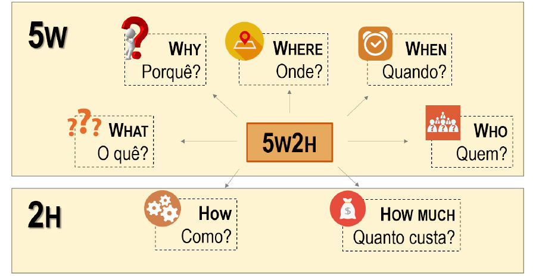

# Documento de Visão

<!-- Adicionar explicação do que é o documento de visão e sua finalidade -->

# 5W2H

<code>5W2H</code> é uma metodologia de gestão que tem como objetivo fornecer uma estrutura clara e objetiva para a definição e execução de projetos e processos. Ela consiste em responder as sete perguntas-chave, divididas em cinco Ws (What, Why, Who, Where, When) e dois Hs (How e How much), que significam espectivamente: O que?, Por quê?, Quem?, Onde?, Quando?, Como? E Quanto custa?. Respondendo a essas perguntas se estará planejando as ações de melhoria ou padronizando processos de forma organizada, garantindo que a execução das atividades aconteça da forma planejada.

O objetivo deste documento é apresentar um entendimento completo do projeto ou processo, alinhando expectativas e metas, evitando problemas de comunicação e, consequentemente, minimizando os riscos de falhas ou erros durante a execução.

 
Figura 1: Exemplo do modelo 5W2H
 

# Modelo 5W2H

## v1.0

# Rich Pictures

&emsp;&emsp;
<code>Rich pictures</code> é uma técnica de modelagem de ideias informal e ideal para reuniões, pois permite um rápido entendimento sobre problemas complexos ou mal definidos. Através de desenhos rascunhados e textos curtos e objetivos, é possível expressar momentos e desejos de forma colaborativa com os stakeholders. Tanto a mão livre quanto o uso de software podem ser utilizados na construção do <code>rich picture</code>, e por ser um modelo informal, não há consenso sobre sua sintaxe e forma de uso.

&emsp;&emsp;
O objetivo deste documento é apresentar todos os <code>rich pictures</code> criados pelos integrantes do grupo durante o processo de entendimento do projeto de um braço mecânico , no qual é um dispositivo robótico que é capaz de executar tarefas mecânicas e/ou eletrônicas. Ele é projetado para imitar a funcionalidade de um braço humano, permitindo que ele possa ser controlado remotamente ou programado para executar tarefas específicas. O objetivo deste projeto é utilizar essa ferramenta em um contexto de empilhamento e organização de produtos em uma farmácia no contexto de uma compra , a fim de aumentar a eficiência e a precisão do gerenciamento de estoque, facilitando a identificação de produtos e melhorando a experiência do cliente.

 Figura 1: Exemplo de rich picture.

<small>Fonte: http://mxmossman.blogspot.com/2017/10/better-software-2017.html.</small>

## Metodologia

&emsp;&emsp;
 Para elaboração do <code>rich picture</code> cada membro do grupo designado para a tarefa confecionará um sobre o projeto e o restantede do grupo após analisar o <code>rich picture</code> poderá ter uma visão mais clara sobre o escopo do projeto em si.

### Versão das Rich-Pictures

&emsp;&emsp;
Neste tópico, são apresentados os rich-pictures criados pelos integrantes. Na primeira versão, elaborou-se uma visão mais simples e visual, que servirá como base para a elaboração da próxima versão do RichPicture pelos membros.

## Resultados

### Rich-Pictures v1

 Figura 2: Rich Picture.

<small>Autor: <a href='https://github.com/DaviMatheus'>Davi Matheus</a>, 2023.</small>

### Rich-Pictures v2

 Figura 3: Rich Picture.

<small>Autor: <a href='https://github.com/Samuelcastro7'>Samuel Macedo</a>, 2023.</small>

## Referências

- [1] - Rational Software Architect RealTime Edition. Disponível em: <https://www.ibm.com/docs/pt-br/rsar/9.5?topic=diagrams-creating-communication>. Acesso em: 17 fev. 2022.
- [2] - Diretriz: Diagrama de Comunicação. Disponível em: <https://www.cin.ufpe.br/~gta/rup-vc/core.base_rup/guidances/guidelines/communication_diagram_FFFEA1B5.html>. Acesso em: 17 fev. 2022.
- [3] - Diagramas de comunicação. Disponível em: <https://www.ibm.com/docs/pt-br/radfws/9.6?topic=SSRTLW_9.6.0/com.ibm.xtools.sequence.doc/topics/ccommndiag.html>. Acesso em: 20 fev. 2022.
- [4] - PROJECT BUILDER. 5W2H: a metodologia de planejamento que vai ajudar na sua gestão. 2022. Disponível em: https://projectbuilder.com.br/blog/5w2h-a-metodologia-de-planejamento-que-vai-ajudar-na-sua-gestao/. Acesso em: 26 abr. 2023.
- [5] - ROCK CONTENT. O que é 5W2H e como aplicá-lo na sua empresa. 2021. Disponível em: https://rockcontent.com/br/blog/5w2h/. Acesso em: 27 abr. 2023.
- [6] - GESTÃO DE PROJETOS - NA PRÁTICA. Metodologia 5W2H. 2019. Disponível em: https://www.youtube.com/watch?v=Hf8oC_tjJSo. Acesso em: 26 abr. 2023.

## Histórico de Versão 

| Data       | Versão | Descrição                             | Autor(es)                                         |
| :--------- | :----- | :------------------------------------ | :------------------------------------------------ |
| 25.04.2022 | 1.0    | Criação do documento                  | [Davi matheus](https://github.com/DaviMatheus)    |
| 26.04.2022 | 1.1    | Criação do documento                  | [Sávio Cunha](https://github.com/savioc2)         |
| 28.04.2022 | 1.2    | Adição do Rich picture v2             | [Samuel Macedo](https://github.com/Samuelcastro7) |
| 28.04.2022 | 1.3    | Conclusão do documento de RichPicture | [Davi matheus](https://github.com/DaviMatheus)    |
