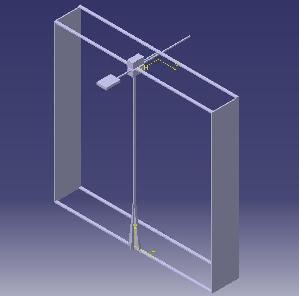
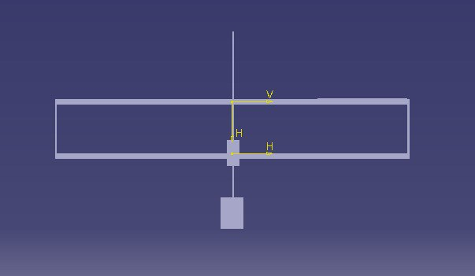

# Definição Estrutura

Visando buscar remédios organizados em prateleiras, o braço robótico será construído para se mover horizontal e verticalmente até a coordenada do remédio selecionado para que, em seguida, sua garra possa pegar e retirar a caixa de remédio da prateleira e a depositar em um local fixo para sua retirada. 
Para isso, o projeto constará de dois motores responsáveis pela movimentação da garra ao longo da prateleira, sendo um para o eixo x e outro para o eixo y, e a garra possuirá mais dois motores para executar sua função, um para o eixo z e outro para o movimento de abrir e fechar. Sendo assim, a estrutura do projeto terá o objetivo de acomodar os motores e fazer com que o braço execute seus movimentos da forma mais simples, segura e rápida possível. 

# Descrição Detalhada das partes da estrutura

O braço robótico se baseará em movimentações simples em três dimensões, logo, existirão três motores e três mecanismos de movimentação principais.A parte superior da estrutura possuirá duas barras horizontais, a primeira possuirá a função de deixar a estrutura mais estável e equilibrada em relação seus esforços. A segunda, além de servir de sustentação do robô, será a responsável por manter fixa o mecanismo de movimentação horizontal. 
A barra voltada para a projeção da garra, isto é, a barra mais próxima dos remédios a serem pegados, estará diretamente conectada com a estrutura de movimentação vertical. Desse modo, será um elemento da estrutura que provavelmente terá que ser reforçado, pois pode haver uma concentração de esforços verticais e devido a barra estar na horizontal pode ser apresentado um certo tipo de deflexão. 
A barra mais afastada terá a função de reduzir os esforços sobre a primeira barra. Analisando-se o projeto, observa-se que a referida barra não possui nenhum tipo de possível carga, desse modo, será posto uma terceira barra. Contudo, esta será inserida transversalmente às outras duas. 
O elemento transversal possuirá dupla função, pois além de transferir os esforços para a barra menos crítica auxiliará na movimentação horizontal. O componente estará conectado ao motor responsável pela movimentação horizontal e à estrutura que abrange a locomoção noutros eixos. O comprimento da referida barra será significativamente menor se comparada com as outras duas.Dessa forma, apesar da sua dupla função, prevê-se que a mesma não apresente muitas complicações. 
O projeto apresenta, além de tais barras superiores, um elemento vertical, central e móvel. Tal componente será o responsável por compreender o mecanismo de movimentação vertical e o mecanismo de projeção da garra. Sendo assim, será possivelmente o elemento mais crítico de toda estrutura, pois além de movimentar- se horizontalmente, terá diversos esforços atuando no mesmo. 
Contudo, para solucionar esse problema é proposto a adição de três peças triangulares na base do objeto vertical, distribuindo os esforços.Porém, tais objetos terão um tamanho tal que não prejudique intensamente a amplitude do movimento vertical e seja suficiente para seu fim.As três peças, no entanto, não estarão encostadas no chão ou em alguma superfície livre devido ao fato da estrutura vertical ter a possibilidade de movimento. 
A fim da movimentação de tal parte, serão colocadas na base da mesma, pequenos rolamentos e um trilho na barra inferior ligada ao componente vertical.A quantidade de tais rodas ou rolamentos dependerá do seu tamanho e da espessura na base com as estruturas de reforço.Os elementos em questão deverão possuir o mínimo de atrito possível com o solo para um bom funcionamento do braço robótico. 
Todavia, destacam-se outras duas porções móveis da estrutura, uma garra e uma barra responsável pelo movimento de profundidade.A garra, um elemento que será comprado (modelo Crock V2), possuirá dentes e será provavelmente revestido de algum material que aumenta o atrito.Assim, o contato com o medicamento será mais eficiente, evitando impasse, como, por exemplo, soltar o medicamento antes do momento adequado. 
A barra será conectada a um mecanismo que possibilitará sua projeção e sua retração em uma extremidade e noutra estará a garra.No entanto, ela deverá ter um tamanho suficiente para que ao ser projetada uma parcela de seu comprimento situe-se anterior ao mecanismo de movimentação nesse eixo.A medida é proposta com o intuito de reduzir o momento fletor. 
As duas barras na parte inferior da estrutura servirão para a fixar melhor, reduzindo balanços e deslocamentos indesejados.Ademais, os dois componentes laterais servirão de apoio, sendo os principais na integridade estrutural e na fixação de componentes eletrônicos.Ambas estruturas estarão em contato com o solo ou com uma superfície livre no seu ambiente de execução.

# Materiais

O material escolhido para a estrutura é o alumínio devido a diversos fatores. A densidade do metal é uma das menores se comparada a de outros metais, ao passo que sua densidade é de 2,70 g/cm3, materiais como o aço e cobre possuem densidade por volta de 7,86 g/cm3 e 8,92 g/cm3, respectivamente. Ademais, a facilidade em seu uso apresenta-se como outra vantagem, pois a ductilidade do alumínio é elevada, facilitando processos de montagem e possibilitando a previsão de rompimento. Além disso, devido à existência de um fornecedor conhecido pelo grupo, seu preço torna-se acessível. 

# Dimensões Gerais

A estrutura possuirá um metro de comprimento, um metro de largura e 22 cm de profundidade. Além disso, a barra a qual a garra está conectada possuirá o comprimento de 52 cm para reduzir o momento, visto que, a profundidade máxima de projeção da garra será 30 cm. 

# Desenhos

# Histórico de Versionamento

| Versão | Data       | Descrição                          | Autor            |
| ------ | ---------- | ---------------------------------- | ---------------- |
| 1.0    | 02/05/2023 | Criação do documento de estruturas | Mauricio Machado |
